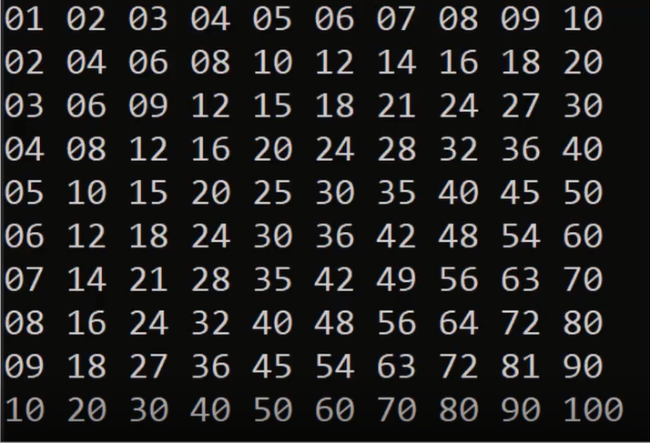

## homework 1:

Write a program that declare a 2d array and print it.
  Example Output:
  1 2 3 4
  5 6 7 8
  9 10 11 12

## homework 1:

Write a program to store the multiplication table result and print it on the screen.
  Output:
  
