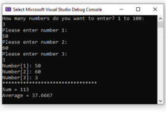

## for-loop-and-array

<h3>Problem 1</h3>

Write a program to do the following:

<h3>Solution</h3>

print-sum-and-array-average.cpp

<h3>Problem 2</h3>

Write a program using array, structure, functions, and for loop to read
information from user for N number of persons.

<h3>Solution</h3>

read-info-from-N-persons.cpp

<h3>Problem 3</h3>

Create a program that reads the names and scores of 10 students from the user. Use an array of structures to store the information. Then, calculate and display the average score of the class.

<h3>Solution</h3>

class-average-score.cpp

<h3>Problem 4</h3>

Write a program that prompts the user to enter the sales figures of 12 months for a company. Store the data in an array, where each element represents a month's sales. Display the total sales for each month and calculate the average monthly sales.

<h3>Solution</h3>

sales-analysis.cpp

<h3>Problem 5</h3>

Create a program that allows the user to enter information about 5 books, including their title, author, and publication year. Use an array of structures to store the book information. Then, display the details of each book in the catalog.

<h3>Solution</h3>

library-catalog.cpp

<h3>Problem 6</h3>

Design a program that allows the user to input the details of 10 products, such as name, price, and quantity. Use an array of structures to store the product information. Then, display the total value of each product (price * quantity) and calculate the overall inventory value.

<h3>Solution</h3>

products-inventory-values.cpp

