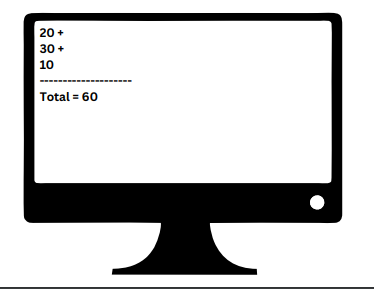
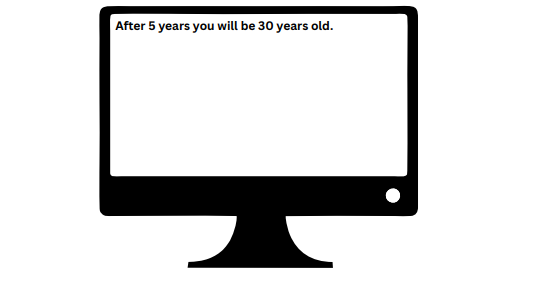
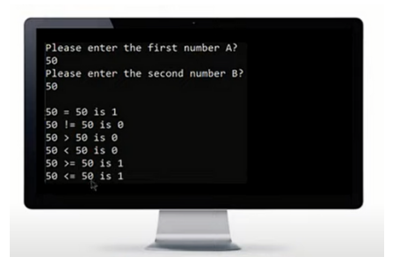
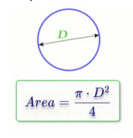
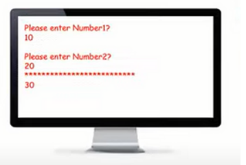
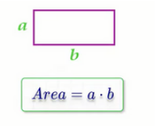
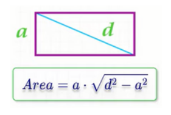
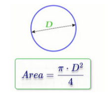
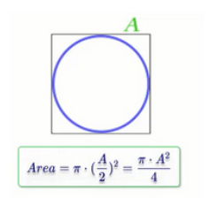

## printing-v1:

<h3>Problems:</h3>

Write programs to do the following:

Do not add this line "using namespace std;" to your code

<h3>Solution:</h3>

print-square.cpp, print-h.cpp, and print-text.cpp

## printing-v2:

<h3>Problems:</h3>

Remove all std:: from all the program in the Printing problems

<h3>Solution:</h3>

print-square-v2.cpp, print-h-v2.cpp, and print-v2-text.cpp

## escape-sequences

<h3>Problems:</h3>

Write programs to do the following:

<h3>Solution:</h3>

ring-bell.cpp, message.cpp, and names.cpp

## Variables

<h3>Problem 1:</h3>

Write a program that declare variables and print them as following:

<h3>solution:</h3>

var-card-info.cpp

<h3>Problem 2:</h3>

Write a program that declare variables num1, num2, and num3 where num1 = 20, num2 = 30, and num3 = 10. Calculate their sum and store it in a variable called total and print them as following:

<h3>solution:</h3>

var-sum-operation.cpp

<h3>Problem 3:</h3>

Consider that the age is equal now to 25 years old print the age after 5 years like the following:

<h3>solution:</h3>

var-age-calculation.cpp

## raeding:

<h3>Problems:</h3>

Repeat the pervious problem, but this time take the data from the user

<h3>Solution:</h3>

read-card-info.cpp, read-sum-operation.cpp, and read-age-calculation.cpp

## size-range

<h3>Problem1</h3>

Write a program that prints size of int, short, float, long, long long, char, double, string, bool 

<h3>Solution</h3>

data-type-size.cpp

<h3>Problem1</h3>

Write a program that prints range of different data types and type modifiers 

<h3>Solution</h3>

data-type-ranges.cpp

## arithmetic operations:

<h3>Problem1</h3>

Write a program to do the following:

<h3>Solution</h3>

small-calculator.cpp

<h3>Problem 2</h3>

Write a program that ask the user to enter a number, then print "Half of number is ???"on the screen.
 Example Input:
 50
 Output:
 Half of 50 is 25

<h3>Solution</h3>

half-number.cpp

<h3>Problem 3</h3>

Write a program to ask the user to enter 3 numbers, then print sum of the
entered numbers.
 Example Input:
 10
 30
 5
 Output:
 45

<h3>Solution</h3>

sum-operation.cpp

<h3>Problem 4</h3>

Write a program to ask the user to enter 3, then print average of the entered
marks.
 Example Input:
 50
 60
 70
 Output:
 60

<h3>Solution</h3>

calculate-average.cpp

<h3>Problem 5</h3>

Write a program to ask the user to enter a number and print number^2, number^3, number^4
 Example Input:
 3
 Output:
 9
 27

<h3>Solution</h3>

calculate-power.cpp

<h3>Problem 6</h3>

Write a program to ask the user to enter Pennies, Nickels, Dimes, Quarters,
Dollars. Print the TotalPennies and TotalDollars.
 Penny = 1
 Nickel = 5
 Dime = 10
 Quarter = 25
 Dollar = 100

<h3>Solution</h3>

total-dollars-pennies.cpp

<h3>Problem 7</h3>

Write a program to read TotalBill and CashPaid and calculate the remainder to be paid back.
 20
 50
 Output:
 30

<h3>Solution</h3>

calculate-remainder.cpp

<h3>Problem 8</h3>

A restaurant charges 10% service fees and 16% sales tax.
Write a program to read BillValue and add service fees and sales tax to it, and
print TotalBill on screen.
 100
 Output:
 127.6

<h3>Solution</h3>

total-bill.cpp

<h3>Problem 9</h3>

Write a program to calculate the task duration in seconds and print it on the
screen. -> Given the time duration of task in the number of days, hours, minutes,
and seconds.
 example
 2
 5
 45
 35
 Output:
 193,535 Seconds

<h3>Solution</h3>

task-in-seconds.cpp

<h3>Problem 10</h3>

 Write a program to read a LoanAmount and a MonthlyPayment and
calculate how many months you need to settle the loan
 Example input:
 5000
 500
 Output:
 10 months

<h3>Solution</h3>

calculate-months-number.cpp

<h3>Problem 11</h3>

 Write a program to read LoanAmount and ask you how many months you need to settle the loan, and calculate the monthly installments.
 Example input:
 5000
 10
 Output:
 500

<h3>Solution</h3>

calculate-monthly-payment.cpp

<h3>Problem 12</h3>

 Write a program to calculate rectangle area and print it on the screen
 Example input:
 5
 10
 Output:
 50

 

<h3>Solution</h3>

calculate-rectangle-area.cpp

<h3>Problem 13</h3>

 Write a program to calculate triangle area then print it on the screen
 Example input:
 10
 8
 Output:
 40

 

<h3>Solution</h3>

calculate-triangle-area.cpp

<h3>Problem 14</h3>

 Write a program to calculate circle area then print it on the screen.
 Example input:
 5
 Output:
 78.54

 

<h3>Solution</h3>

calculate-circle-area.cpp

<h3>Problem 15</h3>

 Write a program to calculate circle area through diameter, then print it on the
screen.
 Example input:
 10
 Output:
 78.5

 

<h3>Solution</h3>

circle-area-through-diameter.cpp

<h3>Problem 16</h3>

Write a program to calculate circle area inscribed in a square, then print it on
the screen.
 Example input:
 10
 Output:
 78.5

 

<h3>Solution</h3>

circle-area-inscribed-square.cpp

<h3>Problem 17</h3>

Write a program to calculate circle area along the circumference, then print it on
the screen
 Example input:
 20
 Output:
 31.847

 

<h3>Solution</h3>

circle-area-along-circumference.cpp

<h3>Problem 18</h3>

Write a program to calculate circle area inscribed in an isosceles triangle, then
print it on the screen.

 Example input:
 20
 10
 Output:
 47.1

 

<h3>Solution</h3>

circle-area-inscribed-isosceles-triangle.cpp

## relational-operators

<h3>Problem</h3>

Using relational operators write a program to do the following 

<h3>Solution</h3>

relational-operators.cpp

## logical-operators

<h3>Problem1</h3>

write programs to solve the following problems: 

<h3>Solution</h3>

logical-operators-problem1.cpp

<h3>Problem2</h3>

write programs to solve the following problems: 

<h3>Solution</h3>

logical-operators-problem2.cpp

## cmath-function

<h3>Problem 1</h3>

 Write a program to calculate rectangle area through diagonal and side area of
rectangle and print it on the screen.
 Example input:
 5
 40
 Output:
 198.431

<h3>Solution</h3>

rectangle-area-diagonal-side.cpp

<h3>Problem 2</h3>

Write a program to calculate circle area then print it on the screen. After finding the result use the ceil function, and print the final
result.
 Example input:
 5
 Output:
 79

<h3>Solution</h3>

circle-area-1.cpp

<h3>Problem 3</h3>

Write a program to calculate circle area through diameter, then print it on the
screen. After finding the result use the ceil function, and print the final
result.

 Example input:
 10
 Output:
 79

<h3>Solution</h3>

circle-area-2.cpp

<h3>Problem 4</h3>

Write a program to calculate circle area inscribed in a square, then print it on
the screen. After finding the result use the ceil function, and print the final
result.

 Example input:
 10
 Output:
 79

<h3>Solution</h3>

circle-area-3.cpp

<h3>Problem 5</h3>

Write a program to calculate circle area along the circumstance, then print it
on the screen.
After finding the result use the floor function, and print the final result
 Example input:
 20
 Output:
 31

<h3>Solution</h3>

circle-area-4.cpp

<h3>Problem 6</h3>

Write a program to calculate circle area inscribed in an isosceles triangle, then
print it on the screen.
After finding the result use the floor function, and print the final result
 Example input:
 20
 10
 Output:
 47

<h3>Solution</h3>

circle-area-5.cpp

<h3>Problem 7</h3>

Write a program to calculate circle area circle described around an arbitrary
triangle, then print it on the screen. After finding the result use the round function, and print the final
result.
 Example input:
 5
 6
 7
 Output:
 40

<h3>Solution</h3>

circle-area-6.cpp

<h3>Problem 8</h3>

Write a program to ask the user to enter a number and print number^2,
number^3, number^4
 Example input:
 3
 Output:
 9
 27
 81

<h3>Solution</h3>

calculate-power-1.cpp

<h3>Problem 9</h3>

Write a program to ask the user to enter a number and power and print result
 Example input:
 2
 4
 Output:
 16

<h3>Solution</h3>

calculate-power-2.cpp

## structures-and-enums

<h3>Problem 1</h3>

 Write a program using struct to do the following (The data should be taken
from the user).

<h3>Solution</h3>

info-card-v1.cpp

<h3>Problem 2</h3>

Repeat the previous problem, but this time add structure another structure by adding address information, and contact information

<h3>Solution</h3>

info-card-v2.cpp

<h3>Problem 3</h3>

instead of using char for gender and boolean for isMarried use enums in info-card-v1.cpp, but this time hardcode the inputs

<h3>Solution</h3>

info-card-v3.cpp

<h3>Problem 4</h3>

Design a program that defines a struct called "Book" with the following members:

title (string)
author (string)
publicationYear (int)
Create two instances of the "Book" struct and print their details.

<h3>Solution</h3>

book-details.cpp

<h3>Problem 5</h3>

Design a program that defines a struct called "Student" with the following members:
name (string)
age (int)
GPA (float)
Create three instances of the "Student" struct and print their details.

<h3>Solution</h3>

student-details.cpp

<h3>Problem 6</h3>

Create a program that defines a struct called "Car" with the following members:

brand (string)
model (string)
year (int)
Define another struct called "Person" with the following members:
name (string)
age (int)
car (Car)
Create an instance of the "Person" struct and assign values to its members. Print the person's name, age, and the details of their car.

<h3>Solution</h3>

person-car.cpp

<h3>Problem 7</h3>

Design a struct called "Point" that represents a point in a 2D coordinate system with x and y coordinates as its members. Initialize two Point objects and calculate the distance between them using the Euclidean distance formula: sqrt((x2-x1)^2 + (y2-y1)^2). Print the distance on the screen.

<h3>Solution</h3>

calculate-distance.cpp

## data-type-conversion

<h3>Problem 1</h3>

Write a program to do the following:
1- Convert string St1 = "43.22" to float, double, integer.
2- Convert integer N1 = 20 to string.
3- Convert double N2 = 33.5 to string.
4- Convert float N3 = 55.23 to string and integer

<h3>Solution</h3>

data-type-conversion-homework1.cpp

<h3>Problem 2</h3>

Write a program that prompts the user to enter a floating-point number and converts it to an integer, truncating the decimal part. Print the resulting integer.

<h3>Solution</h3>

data-type-conversion-homework2.cpp

<h3>Problem 3</h3>

Create a program that asks the user to enter a character and converts it to its corresponding ASCII value. Print the ASCII value on the screen.

<h3>Solution</h3>

data-type-conversion-homework3.cpp

<h3>Problem 4</h3>

Design a program that takes an integer as input and converts it to a floating-point number. Multiply the resulting float by 1.5 and print the final result.

<h3>Solution</h3>

data-type-conversion-homework4.cpp

<h3>Problem 5</h3>

Develop a program that reads a decimal number and converts it to a character. Print the character on the screen.

<h3>Solution</h3>

data-type-conversion-homework5.cpp

<h3>Problem 6</h3>

Write a program that prompts the user to enter a character and converts it to its lowercase equivalent. If the character is already lowercase, print it as is. Otherwise, convert it to lowercase and display the result.

<h3>Solution</h3>

data-type-conversion-homework6.cpp

## functions

<h3>Problem 1</h3>

write a program that contains functions that do the following and call them in
the main function.

<h3>Solution</h3>

printing-functions.cpp

<h3>Problem 2</h3>

write a procedure and a function to do the following in one program:

<h3>Solution</h3>

procedure-and-function.cpp

Solve the following problems using procedures or functions:

<h3>Problem 3</h3>

Write a program to print your name on the screen.

<h3>Solution</h3>

print-my-name.cpp

<h3>Problem 4</h3>

Write a program to ask the user to enter his/her name and print it on the
screen.

<h3>Solution</h3>

print-user-name.cpp

<h3>Problem 5</h3>

Write a program to calculate rectangle area and print it on the screen.
 Example Input:
 5
 10
 Output: 50

<h3>Solution</h3>

rectangle-area-1.cpp

<h3>Problem 6</h3>

Write a program to calculate rectangle area through diagonal and side area of
rectangle and print it on the screen.
 Example Input:
 5
 40
 Output: 198.431

<h3>Solution</h3>

rectangle-area-2.cpp

<h3>Problem 7</h3>

Write a program to calculate circle area then print it on the screen.
 Example Input:
 5
 Output: 78.5

<h3>Solution</h3>

circle-area-1.cpp

<h3>Problem 8</h3>

Write a program to calculate circle area through diameter, then print it on the
screen.
 Example Input:
 10
 Output: 78.5

<h3>Solution</h3>

circle-area-2.cpp

<h3>Problem 9</h3>

Write a program to calculate circle area inscribed in a square, then print it on
the screen.
 Example Input:
 10
 Output: 78.5

<h3>Solution</h3>

circle-area-3.cpp

<h3>Problem 10</h3>

Write a program to calculate circle area along the circumference, then print it
on the screen.

 Example Input:
 20
 Output: 31.847

<h3>Solution</h3>

circle-area-4.cpp

<h3>Problem 11</h3>

 Write a program to calculate circle area inscribed in an isosceles triangle, then
print it on the screen.

 Example Input:
 20
 10
 Output: 47.1

<h3>Solution</h3>

circle-area-5.cpp

<h3>Problem 12</h3>

Write a program to calculate circle area circle described around an arbitrary
triangle, then print it on the screen.

 Example Input:
 5
 6
 7
 Output: 40. 0677

<h3>Solution</h3>

circle-area-6.cpp

<h3>Problem 13</h3>

Write a program to ask the user to enter a number and print number^2,
number^3, number^4
 Example Input:
 3
 Output:
 3^2 = 9
 3^3 = 27
 3^4 = 81

<h3>Solution</h3>

power-of-2-3-4.cpp

