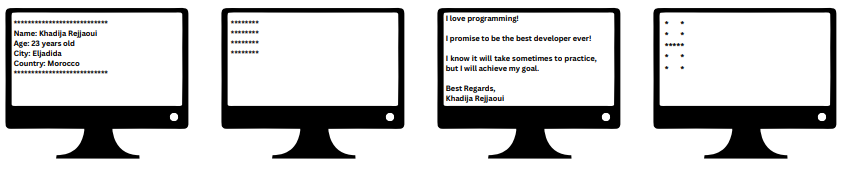
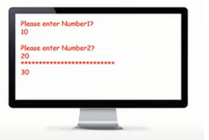
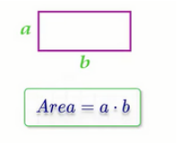
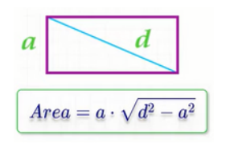
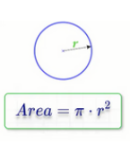
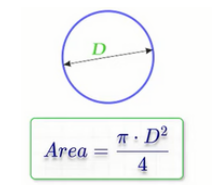
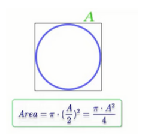
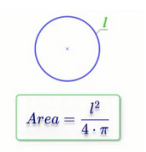
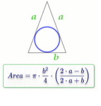

## functions

<h3>Problem 1</h3>

write a program that contains functions that do the following and call them in
the main function.

<h3>Solution</h3>

printing-functions.cpp

<h3>Problem 2</h3>

write a procedure and a function to do the following in one program:

<h3>Solution</h3>

procedure-and-function.cpp

Solve the following problems using procedures or functions:

<h3>Problem 3</h3>

Write a program to print your name on the screen.

<h3>Solution</h3>

print-my-name.cpp

<h3>Problem4</h3>

Write a program to ask the user to enter his/her name and print it on the
screen.

<h3>Solution</h3>

print-user-name.cpp

<h3>Problem 5</h3>

Write a program to calculate rectangle area and print it on the screen.
 Example Input:
 5
 10
 Output: 50

<h3>Solution</h3>

rectangle-area-1.cpp

<h3>Problem 6</h3>

Write a program to calculate rectangle area through diagonal and side area of
rectangle and print it on the screen.
 Example Input:
 5
 40
 Output: 198.431

<h3>Solution</h3>

rectangle-area-2.cpp

<h3>Problem 7</h3>

Write a program to calculate circle area then print it on the screen.
 Example Input:
 5
 Output: 78.5

<h3>Solution</h3>

circle-area-1.cpp

<h3>Problem 8</h3>

Write a program to calculate circle area through diameter, then print it on the
screen.
 Example Input:
 10
 Output: 78.5

<h3>Solution</h3>

circle-area-2.cpp

<h3>Problem 9</h3>

Write a program to calculate circle area inscribed in a square, then print it on
the screen.
 Example Input:
 10
 Output: 78.5

<h3>Solution</h3>

circle-area-3.cpp

<h3>Problem 10</h3>

Write a program to calculate circle area along the circumference, then print it
on the screen.

 Example Input:
 20
 Output: 31.847

<h3>Solution</h3>

circle-area-4.cpp

<h3>Problem 11</h3>

 Write a program to calculate circle area inscribed in an isosceles triangle, then
print it on the screen.

 Example Input:
 20
 10
 Output: 47.1

<h3>Solution</h3>

circle-area-5.cpp

