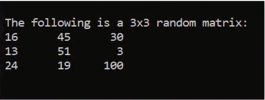
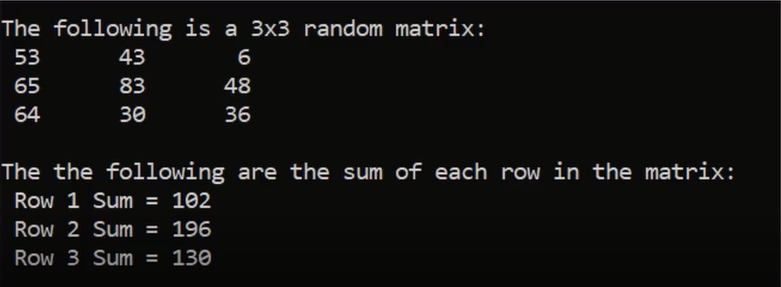
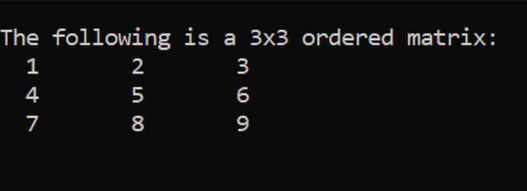
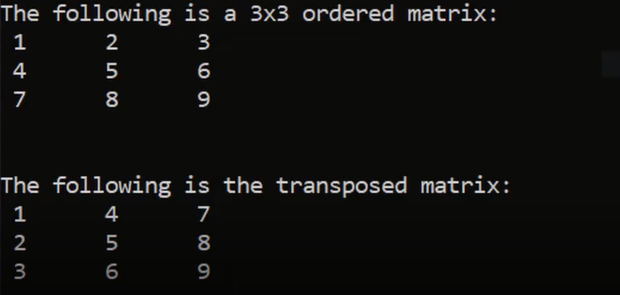
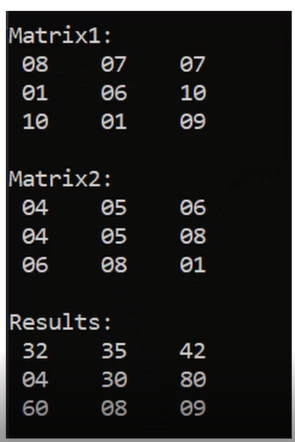
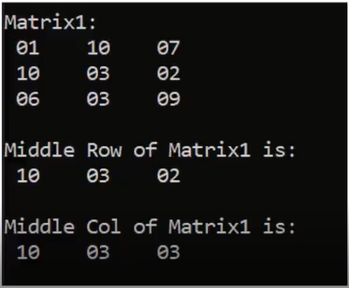

## <a href = "https://github.com/Khadijarejjaoui99/CPlusPlus_Problems_and_Solutions/tree/main/Problems-and-Solutions-Set3/problem1">Problem 1: 3x3 Random Matrix </a>

Write a program to fill a 3x3 matrix with random numbers from 1 to 100.
   

## <a href="https://github.com/Khadijarejjaoui99/CPlusPlus_Problems_and_Solutions/tree/main/Problems-and-Solutions-Set3/problem2">Problem 2: Sum Each Row </a>

Write a program to fill a 3x3 matrix with random numbers from 1 to 100. And print the sum of each row.
   

## <a href="https://github.com/Khadijarejjaoui99/CPlusPlus_Problems_and_Solutions/tree/main/Problems-and-Solutions-Set3/problem3">Problem 3: Sum Each Row in Matrix </a>

Write a program to fill a 3x3 matrix with random numbers from 1 to 100. Then sum each row and store the result in array.
   

## <a href="https://github.com/Khadijarejjaoui99/CPlusPlus_Problems_and_Solutions/tree/main/Problems-and-Solutions-Set3/problem4">Problem 4: Sum Each Colomun </a>

Write a program to fill a 3x3 matrix with random numbers from 1 to 100. And print the sum of each colomun.
   

## <a href="https://github.com/Khadijarejjaoui99/CPlusPlus_Problems_and_Solutions/tree/main/Problems-and-Solutions-Set3/problem5">Problem 5: Sum Each Colomun In Another Array </a>

Write a program to fill a 3x3 matrix with random numbers from 1 to 100. Then sum each column and store the result in array.
   

## <a href="https://github.com/Khadijarejjaoui99/CPlusPlus_Problems_and_Solutions/tree/main/Problems-and-Solutions-Set3/problem6">Problem 6: 3X3 Ordered Matrix: </a>

Write a program to fill a 3x3 matrix with Ordered numbers.
   

## <a href="https://github.com/Khadijarejjaoui99/CPlusPlus_Problems_and_Solutions/tree/main/Problems-and-Solutions-Set3/problem7">Problem 7: 3X3 Transposed Matrix: </a>

Write a program to fill a 3x3 matrix with Ordered numbers, and print it, then transpose the matrix and print it.
   

## <a href="https://github.com/Khadijarejjaoui99/CPlusPlus_Problems_and_Solutions/tree/main/Problems-and-Solutions-Set3/problem8">Problem 8: Multiply Two 3x3 Matrices: </a>

Fill two matrices with random numbers from 1 to 10. Then multiply them into a 3rd matrix and print it.
   

## <a href="https://github.com/Khadijarejjaoui99/CPlusPlus_Problems_and_Solutions/tree/main/Problems-and-Solutions-Set3/problem9">Problem 9: Print Middle Row And Middle Column: </a>

Fill a matrix with random numbers from 1 to 10. Then print middle row and middle column.
   

## <a href="https://github.com/Khadijarejjaoui99/CPlusPlus_Problems_and_Solutions/tree/main/Problems-and-Solutions-Set3/problem10">Problem 10: Print Matrix Sum: </a>

Fill a matrix with random numbers from 1 to 10. Then print sum of the matrix.
   

## <a href="https://github.com/Khadijarejjaoui99/CPlusPlus_Problems_and_Solutions/tree/main/Problems-and-Solutions-Set3/problem11">Problem 11: Check Matrices Equality: </a>

Write a program to compare two matrices and check if they are equal or not. (Fill each matrix with random numbers from 1 to 10)
   

## <a href="https://github.com/Khadijarejjaoui99/CPlusPlus_Problems_and_Solutions/tree/main/Problems-and-Solutions-Set3/problem12">Problem 12: Check Typical Matrices : </a>

Write a program to compare two matrices and check if they are typical or not. (Fill each matrix with random numbers from 1 to 10)
   
