# Problems and Solutions Set 3

## <a href = "https://github.com/Khadijarejjaoui99/CPlusPlus_Problems_and_Solutions/tree/main/CPlusPlus-Problems-and-Solutions/Problems-and-Solutions-Set-3/problem01">Problem 01: 3x3 Random Matrix </a>

Write a program to fill a 3x3 matrix with random numbers from 1 to 100.
   

## <a href="https://github.com/Khadijarejjaoui99/CPlusPlus_Problems_and_Solutions/tree/main/CPlusPlus-Problems-and-Solutions/Problems-and-Solutions-Set-3/problem02">Problem 02: Sum Each Row </a>

Write a program to fill a 3x3 matrix with random numbers from 1 to 100. And print the sum of each row.
   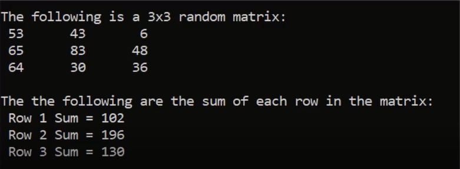

## <a href="https://github.com/Khadijarejjaoui99/CPlusPlus_Problems_and_Solutions/tree/main/CPlusPlus-Problems-and-Solutions/Problems-and-Solutions-Set-3/problem03">Problem 03: Sum Each Row in Matrix In Another Array </a>

Write a program to fill a 3x3 matrix with random numbers from 1 to 100. Then sum each row and store the result in array.
   

## <a href="https://github.com/Khadijarejjaoui99/CPlusPlus_Problems_and_Solutions/tree/main/CPlusPlus-Problems-and-Solutions/Problems-and-Solutions-Set-3/problem04">Problem 04: Sum Each Column  </a>

Write a program to fill a 3x3 matrix with random numbers from 1 to 100. And print the sum of each Column.
   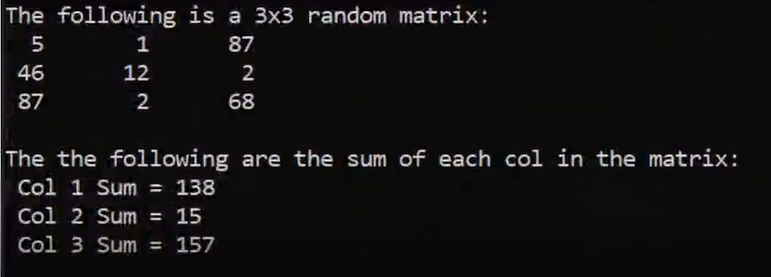

## <a href="https://github.com/Khadijarejjaoui99/CPlusPlus_Problems_and_Solutions/tree/main/CPlusPlus-Problems-and-Solutions/Problems-and-Solutions-Set-3/problem05">Problem 05: Sum Each Column  In Another Array </a>

Write a program to fill a 3x3 matrix with random numbers from 1 to 100. Then sum each Column and store the result in array.
   

## <a href="https://github.com/Khadijarejjaoui99/CPlusPlus_Problems_and_Solutions/tree/main/CPlusPlus-Problems-and-Solutions/Problems-and-Solutions-Set-3/problem06">Problem 06: 3X3 Ordered Matrix: </a>

Write a program to fill a 3x3 matrix with Ordered numbers.
   

## <a href="https://github.com/Khadijarejjaoui99/CPlusPlus_Problems_and_Solutions/tree/main/CPlusPlus-Problems-and-Solutions/Problems-and-Solutions-Set-3/problem07">Problem 07: 3X3 Transposed Matrix: </a>

Write a program to fill a 3x3 matrix with Ordered numbers, and print it, then transpose the matrix and print it.
   

## <a href="https://github.com/Khadijarejjaoui99/CPlusPlus_Problems_and_Solutions/tree/main/CPlusPlus-Problems-and-Solutions/Problems-and-Solutions-Set-3/problem08">Problem 08: Multiply Two 3x3 Matrices: </a>

Fill two matrices with random numbers from 1 to 10. Then multiply them into a 3rd matrix and print it.
   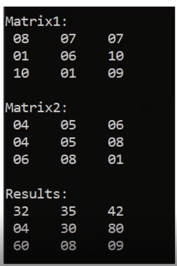

## <a href="https://github.com/Khadijarejjaoui99/CPlusPlus_Problems_and_Solutions/tree/main/CPlusPlus-Problems-and-Solutions/Problems-and-Solutions-Set-3/problem09">Problem 09: Print Middle Row And Middle Column: </a>

Fill a matrix with random numbers from 1 to 10. Then print middle row and middle column.
   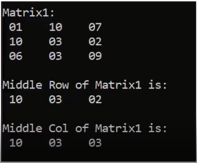

## <a href="https://github.com/Khadijarejjaoui99/CPlusPlus_Problems_and_Solutions/tree/main/CPlusPlus-Problems-and-Solutions/Problems-and-Solutions-Set-3/problem10">Problem 10: Print Matrix Sum: </a>

Fill a matrix with random numbers from 1 to 10. Then print sum of the matrix.
   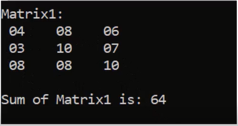

## <a href="https://github.com/Khadijarejjaoui99/CPlusPlus_Problems_and_Solutions/tree/main/CPlusPlus-Problems-and-Solutions/Problems-and-Solutions-Set-3/problem11">Problem 11: Check Matrices Equality: </a>

Write a program to compare two matrices and check if they are equal or not. (Fill each matrix with random numbers from 1 to 10)
   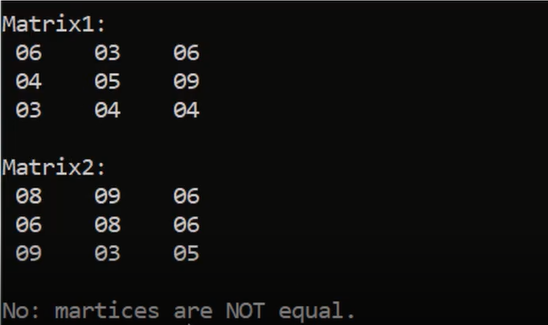

## <a href="https://github.com/Khadijarejjaoui99/CPlusPlus_Problems_and_Solutions/tree/main/CPlusPlus-Problems-and-Solutions/Problems-and-Solutions-Set-3/problem12">Problem 12: Check Typical Matrices : </a>

Write a program to compare two matrices and check if they are typical or not. (Fill each matrix with random numbers from 1 to 10)
   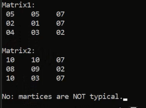

## <a href="https://github.com/Khadijarejjaoui99/CPlusPlus_Problems_and_Solutions/tree/main/CPlusPlus-Problems-and-Solutions/Problems-and-Solutions-Set-3/problem13">Problem 13: Check Identity Matrix : </a>

Write a program to check if a matrix is identical or not.
   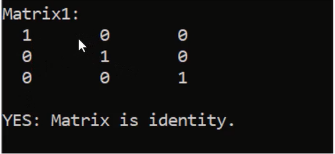

## <a href="https://github.com/Khadijarejjaoui99/CPlusPlus_Problems_and_Solutions/tree/main/CPlusPlus-Problems-and-Solutions/Problems-and-Solutions-Set-3/problem14">Problem 14: Check Scalar Matrix : </a>

Write a program to check if a matrix is scalar or not.
   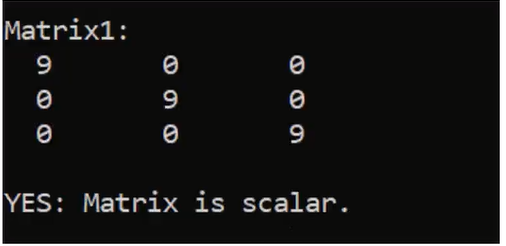

## <a href="https://github.com/Khadijarejjaoui99/CPlusPlus_Problems_and_Solutions/tree/main/CPlusPlus-Problems-and-Solutions/Problems-and-Solutions-Set-3/problem15">Problem 15: Number Count : </a>

Write a program to print the count of a given number in a matrix.
   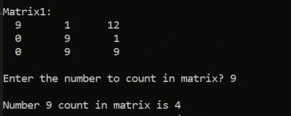

## <a href="https://github.com/Khadijarejjaoui99/CPlusPlus_Problems_and_Solutions/tree/main/CPlusPlus-Problems-and-Solutions/Problems-and-Solutions-Set-3/problem16">Problem 16: Check Sparce Matrix: </a>

Write a program to check if a matrix is sparce or not.
   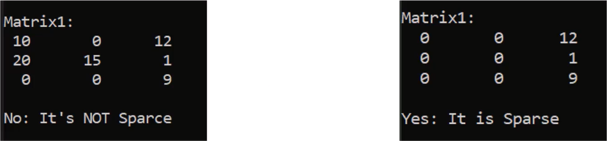

## <a href="https://github.com/Khadijarejjaoui99/CPlusPlus_Problems_and_Solutions/tree/main/CPlusPlus-Problems-and-Solutions/Problems-and-Solutions-Set-3/problem17">Problem 17: Number Exists In Matrix: </a>

Write a program to check if a given number exists in matrix or not.
   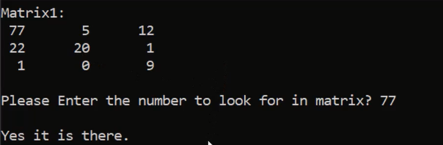

## <a href="https://github.com/Khadijarejjaoui99/CPlusPlus_Problems_and_Solutions/tree/main/CPlusPlus-Problems-and-Solutions/Problems-and-Solutions-Set-3/problem18">Problem 18: Intersected Numbers In Matrices: </a>

Write a program to print the intersectd Numbers in two matrices.
   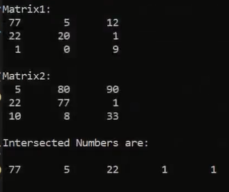

## <a href="https://github.com/Khadijarejjaoui99/CPlusPlus_Problems_and_Solutions/tree/main/CPlusPlus-Problems-and-Solutions/Problems-and-Solutions-Set-3/problem19">Problem 19: Min/ Max Number In Matrix: </a>

Write a program to print the max and min number in a matrix.
   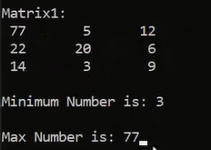

## <a href="https://github.com/Khadijarejjaoui99/CPlusPlus_Problems_and_Solutions/tree/main/CPlusPlus-Problems-and-Solutions/Problems-and-Solutions-Set-3/problem20">Problem 20: Palindrome Matrix </a>

Write a program to check if a matrix is palindrome or not.
   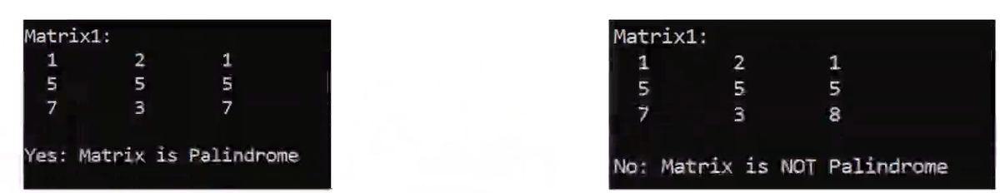

## <a href="https://github.com/Khadijarejjaoui99/CPlusPlus_Problems_and_Solutions/tree/main/CPlusPlus-Problems-and-Solutions/Problems-and-Solutions-Set-3/problem21">Problem 21: Fibonacci series </a>

Write a program to print fibonacci series.
  Example output: Fibonacci Series of 10
   

## <a href="https://github.com/Khadijarejjaoui99/CPlusPlus_Problems_and_Solutions/tree/main/CPlusPlus-Problems-and-Solutions/Problems-and-Solutions-Set-3/problem22">Problem 22: Fibonacci series using Recursion</a>

Write a program to print fibonacci series, using recursion.
  Example output: Fibonacci Series of 10
   

## <a href="https://github.com/Khadijarejjaoui99/CPlusPlus_Problems_and_Solutions/tree/main/CPlusPlus-Problems-and-Solutions/Problems-and-Solutions-Set-3/problem23">Problem 23: First Letter of each word in the string:</a>

Write a program to print first letter of each word in the string

## <a href="https://github.com/Khadijarejjaoui99/CPlusPlus_Problems_and_Solutions/tree/main/CPlusPlus-Problems-and-Solutions/Problems-and-Solutions-Set-3/problem24">Problem 24: Upper First Letter of each word:</a>

Write a program to read a string then uppercase the first letter of each word in the string.

## <a href="https://github.com/Khadijarejjaoui99/CPlusPlus_Problems_and_Solutions/tree/main/CPlusPlus-Problems-and-Solutions/Problems-and-Solutions-Set-3/problem25">Problem 25: Lower First Letter of each word:</a>

Write a program to read a string then lowercase the first letter of each word in the string.

## <a href="https://github.com/Khadijarejjaoui99/CPlusPlus_Problems_and_Solutions/tree/main/CPlusPlus-Problems-and-Solutions/Problems-and-Solutions-Set-3/problem26">Problem 26:Lower/ Upper All the string:</a>

Write a program to read a string then lower all its charaters then upper all its characters, and print them.

## <a href="https://github.com/Khadijarejjaoui99/CPlusPlus_Problems_and_Solutions/tree/main/CPlusPlus-Problems-and-Solutions/Problems-and-Solutions-Set-3/problem27">Problem 27:Invert Character Case:</a>

Write a program to read a character then invert its case and print it.

## <a href="https://github.com/Khadijarejjaoui99/CPlusPlus_Problems_and_Solutions/tree/main/CPlusPlus-Problems-and-Solutions/Problems-and-Solutions-Set-3/problem28">Problem 28:Invert All letters Case in a String:</a>

Write a program to read a string then invert its letters case and print it.

## <a href="https://github.com/Khadijarejjaoui99/CPlusPlus_Problems_and_Solutions/tree/main/CPlusPlus-Problems-and-Solutions/Problems-and-Solutions-Set-3/problem29">Problem 29: Count Small and Capital Letters in string:</a>

Write a program to read a string then print its length, and print its Capital letters count and its Smaller letters Count.

## <a href="https://github.com/Khadijarejjaoui99/CPlusPlus_Problems_and_Solutions/tree/main/CPlusPlus-Problems-and-Solutions/Problems-and-Solutions-Set-3/problem30">Problem 30: Count character in a String :</a>

Write a program to read a string and a character then count the character in that string

## <a href="https://github.com/Khadijarejjaoui99/CPlusPlus_Problems_and_Solutions/tree/main/CPlusPlus-Problems-and-Solutions/Problems-and-Solutions-Set-3/problem31">Problem 31: Count character in a String (Match Case) :</a>

Write a program to read a string and a character then count the character in that string (Match case or not).

## <a href="https://github.com/Khadijarejjaoui99/CPlusPlus_Problems_and_Solutions/tree/main/CPlusPlus-Problems-and-Solutions/Problems-and-Solutions-Set-3/problem32">Problem 32: Is a Vowel</a>

Write a program to read a character and check if the character is vowel or not (vowels are: a,e,i,o,u).

## <a href="https://github.com/Khadijarejjaoui99/CPlusPlus_Problems_and_Solutions/tree/main/CPlusPlus-Problems-and-Solutions/Problems-and-Solutions-Set-3/problem33">Problem 33: Vowels Count</a>

Write a program to read a string and count the number of vowels in it (vowels are: a,e,i,o,u).

## <a href="https://github.com/Khadijarejjaoui99/CPlusPlus_Problems_and_Solutions/tree/main/CPlusPlus-Problems-and-Solutions/Problems-and-Solutions-Set-3/problem34">Problem 34: Vowels Count</a>

Write a program to read a string and print all the vowels in the string (vowels are: a,e,i,o,u).

## <a href="https://github.com/Khadijarejjaoui99/CPlusPlus_Problems_and_Solutions/tree/main/CPlusPlus-Problems-and-Solutions/Problems-and-Solutions-Set-3/problem35">Problem 35: Print Each Word In String</a>

Write a program to read a string and print each word in it in a separate line.

## <a href="https://github.com/Khadijarejjaoui99/CPlusPlus_Problems_and_Solutions/tree/main/CPlusPlus-Problems-and-Solutions/Problems-and-Solutions-Set-3/problem36">Problem 36: Count Each Word In String</a>

Write a program to read a string and count each word in it.

## <a href="https://github.com/Khadijarejjaoui99/CPlusPlus_Problems_and_Solutions/tree/main/CPlusPlus-Problems-and-Solutions/Problems-and-Solutions-Set-3/problem37">Problem 37: Split a String</a>

Write a program to read a string and make a function that split each word in vector.

## <a href="https://github.com/Khadijarejjaoui99/CPlusPlus_Problems_and_Solutions/tree/main/CPlusPlus-Problems-and-Solutions/Problems-and-Solutions-Set-3/problem38">Problem 38: Trim string</a>

Write a program to read a string then trim its left, its right and all of it.

## <a href="https://github.com/Khadijarejjaoui99/CPlusPlus_Problems_and_Solutions/tree/main/CPlusPlus-Problems-and-Solutions/Problems-and-Solutions-Set-3/problem39">Problem 39: Join String</a>

Write a program to join a vector of strings into one string and print it.

## <a href="https://github.com/Khadijarejjaoui99/CPlusPlus_Problems_and_Solutions/tree/main/CPlusPlus-Problems-and-Solutions/Problems-and-Solutions-Set-3/problem40">Problem 40: Join String (Overloading)</a>

Write a program to join a vector and array of strings into one string and print it (using function overloading).

## <a href="https://github.com/Khadijarejjaoui99/CPlusPlus_Problems_and_Solutions/tree/main/CPlusPlus-Problems-and-Solutions/Problems-and-Solutions-Set-3/problem41">Problem 41: Reverse a String</a>

Write a program to read a string then print its reverse.

## <a href="https://github.com/Khadijarejjaoui99/CPlusPlus_Problems_and_Solutions/tree/main/CPlusPlus-Problems-and-Solutions/Problems-and-Solutions-Set-3/problem42">Problem 42: Replace Words in String</a>

Write a program to replace words in a string.

## <a href="https://github.com/Khadijarejjaoui99/CPlusPlus_Problems_and_Solutions/tree/main/CPlusPlus-Problems-and-Solutions/Problems-and-Solutions-Set-3/problem43">Problem 43: Replace Words in String</a>

Write a program to replace words in a string, using custom function.

## <a href="https://github.com/Khadijarejjaoui99/CPlusPlus_Problems_and_Solutions/tree/main/CPlusPlus-Problems-and-Solutions/Problems-and-Solutions-Set-3/problem44">Problem 44: Remove Punctuations from a String</a>

Write a program to read a string, then remove all punctuations in the string.

## <a href="https://github.com/Khadijarejjaoui99/CPlusPlus_Problems_and_Solutions/tree/main/CPlusPlus-Problems-and-Solutions/Problems-and-Solutions-Set-3/problem45">Problem 45: Convert a line of Data to a Record</a>

Write a program to convert a line of data to a record and print it.
  
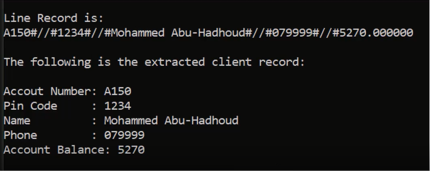

## <a href="https://github.com/Khadijarejjaoui99/CPlusPlus_Problems_and_Solutions/tree/main/CPlusPlus-Problems-and-Solutions/Problems-and-Solutions-Set-3/problem46">Problem 46: Convert a Record to a Line of Data</a>

Write a program to convert a record to a line and print it.
  
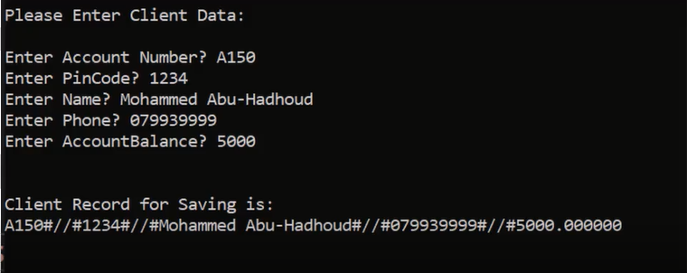

## <a href="https://github.com/Khadijarejjaoui99/CPlusPlus_Problems_and_Solutions/tree/main/CPlusPlus-Problems-and-Solutions/Problems-and-Solutions-Set-3/problem47">Problem 47: Add Clients to file</a>

Write a program to ask you to enter clients and save them in the file.
  
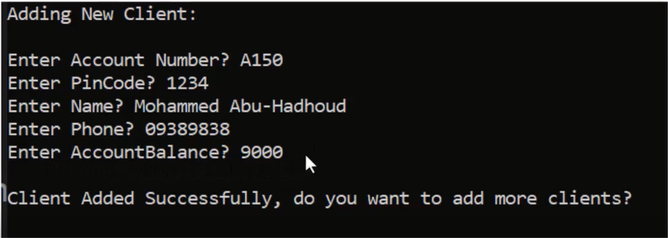

## <a href="https://github.com/Khadijarejjaoui99/CPlusPlus_Problems_and_Solutions/tree/main/CPlusPlus-Problems-and-Solutions/Problems-and-Solutions-Set-3/problem48">Problem 48: Show All Clients </a>

Write a program to read a clients file and show them on the screen as following:
  
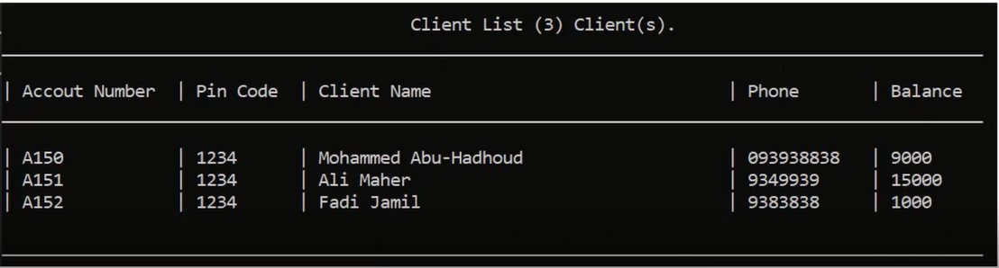

## <a href="https://github.com/Khadijarejjaoui99/CPlusPlus_Problems_and_Solutions/tree/main/CPlusPlus-Problems-and-Solutions/Problems-and-Solutions-Set-3/problem49">Problem 49: Find Client by AccountNumber</a>

Write a program to find a client by AccountNumber and print it on the screen.
  
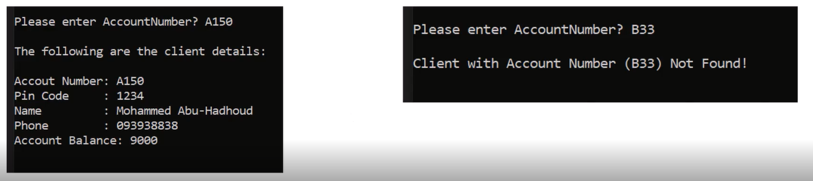

## <a href="https://github.com/Khadijarejjaoui99/CPlusPlus_Problems_and_Solutions/tree/main/CPlusPlus-Problems-and-Solutions/Problems-and-Solutions-Set-3/problem50">Problem 50: Delete Client by AccountNumber</a>

Write a program to delete a client by AccountNumber.
  
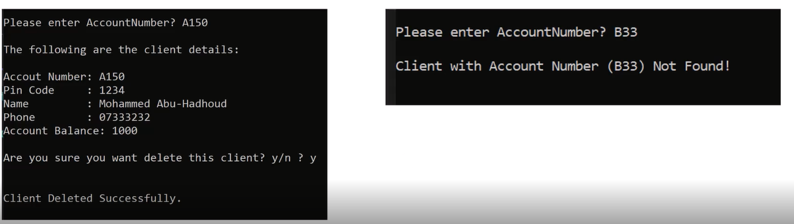

## <a href="https://github.com/Khadijarejjaoui99/CPlusPlus_Problems_and_Solutions/tree/main/CPlusPlus-Problems-and-Solutions/Problems-and-Solutions-Set-3/problem51">Problem 51: Update Client by AccountNumber</a>

Write a program to update a client data by AccountNumber.
  
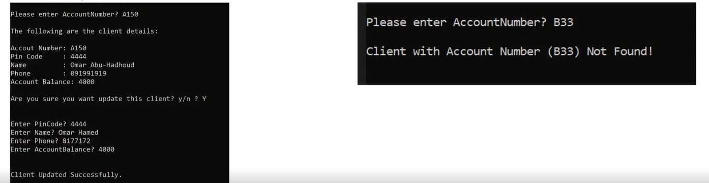
