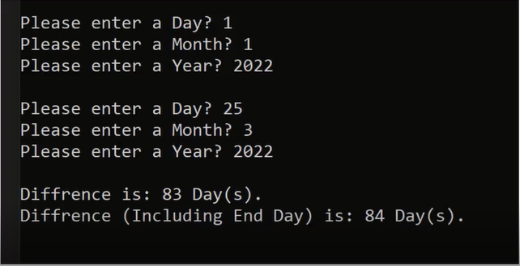

# Problems and Solutions Set 4

## <a href = "https://github.com/Khadijarejjaoui99/CPlusPlus_Problems_and_Solutions/tree/main/CPlusPlus-Problems-and-Solutions/Problems-and-Solutions-Set-4/problem01">Problem 01: Number To Text</a>

Write a program to read a number and print the text of that number.
  

## <a href = "https://github.com/Khadijarejjaoui99/CPlusPlus_Problems_and_Solutions/tree/main/CPlusPlus-Problems-and-Solutions/Problems-and-Solutions-Set-4/problem02">Problem 02: Leap Year</a>

Write a program to check if a year is a leap year or not.
  

## <a href = "https://github.com/Khadijarejjaoui99/CPlusPlus_Problems_and_Solutions/tree/main/CPlusPlus-Problems-and-Solutions/Problems-and-Solutions-Set-4/problem03">Problem 03: Leap Year (One Line of Code)</a>

Solve leap year problem with one line of code only.
  

## <a href = "https://github.com/Khadijarejjaoui99/CPlusPlus_Problems_and_Solutions/tree/main/CPlusPlus-Problems-and-Solutions/Problems-and-Solutions-Set-4/problem04">Problem 04: Number of Days Hours Minutes Seconds in a Year</a>

Write a program to print number of days, hours, minutes, and seconds in a year.
  

## <a href = "https://github.com/Khadijarejjaoui99/CPlusPlus_Problems_and_Solutions/tree/main/CPlusPlus-Problems-and-Solutions/Problems-and-Solutions-Set-4/problem05">Problem 05: Number of Days Hours Minutes Seconds in a month</a>

Write a program to print number of days, hours, minutes, and seconds in a month.
  

## <a href = "https://github.com/Khadijarejjaoui99/CPlusPlus_Problems_and_Solutions/tree/main/CPlusPlus-Problems-and-Solutions/Problems-and-Solutions-Set-4/problem06">Problem 06: Number of Days in a month (Short Logic)</a>

Write a program to print number of days in a certain month.
  

## <a href = "https://github.com/Khadijarejjaoui99/CPlusPlus_Problems_and_Solutions/tree/main/CPlusPlus-Problems-and-Solutions/Problems-and-Solutions-Set-4/problem07">Problem 07: Day Name</a>

Write a program to read a date and print the day name of the week.
  

  

## <a href = "https://github.com/Khadijarejjaoui99/CPlusPlus_Problems_and_Solutions/tree/main/CPlusPlus-Problems-and-Solutions/Problems-and-Solutions-Set-4/problem08">Problem 08: Month Calendar</a>

Write a program to print month calendar.
  

## <a href = "https://github.com/Khadijarejjaoui99/CPlusPlus_Problems_and_Solutions/tree/main/CPlusPlus-Problems-and-Solutions/Problems-and-Solutions-Set-4/problem09">Problem 09: Year Calendar</a>

Write a program to print year calendar.
  

## <a href = "https://github.com/Khadijarejjaoui99/CPlusPlus_Problems_and_Solutions/tree/main/CPlusPlus-Problems-and-Solutions/Problems-and-Solutions-Set-4/problem10">Problem 10: Days from the Beginning of the Year</a>

Write a program to print total days from the beginning of the year.
  

## <a href = "https://github.com/Khadijarejjaoui99/CPlusPlus_Problems_and_Solutions/tree/main/CPlusPlus-Problems-and-Solutions/Problems-and-Solutions-Set-4/problem11">Problem 11: Date from Day Order in a Year</a>

Write a program to print total days from the beginning of the year.
  Take the total days and convert them back to a date.
  

## <a href = "https://github.com/Khadijarejjaoui99/CPlusPlus_Problems_and_Solutions/tree/main/CPlusPlus-Problems-and-Solutions/Problems-and-Solutions-Set-4/problem12">Problem 12: Add Days to Date</a>

Write a program to read date and read how many days to add to add to it, then print result on the screen.
  

## <a href = "https://github.com/Khadijarejjaoui99/CPlusPlus_Problems_and_Solutions/tree/main/CPlusPlus-Problems-and-Solutions/Problems-and-Solutions-Set-4/problem13">Problem 13: Date1 Less than Date2</a>

Write a program to read Date1 and Date2 and check if Date1 less than Date 2.
  

## <a href = "https://github.com/Khadijarejjaoui99/CPlusPlus_Problems_and_Solutions/tree/main/CPlusPlus-Problems-and-Solutions/Problems-and-Solutions-Set-4/problem14">Problem 14: Date1 Equal to Date2</a>

Write a program to read Date1 and Date2 and check if Date1 equal to Date 2.
  

## <a href = "https://github.com/Khadijarejjaoui99/CPlusPlus_Problems_and_Solutions/tree/main/CPlusPlus-Problems-and-Solutions/Problems-and-Solutions-Set-4/problem15">Problem 15: Last Day, Last Month</a>

Write a program to read a date and check:
  _ If it is the last Day in the Month.
  _ If it is the last Month in the Year.
  

## <a href = "https://github.com/Khadijarejjaoui99/CPlusPlus_Problems_and_Solutions/tree/main/CPlusPlus-Problems-and-Solutions/Problems-and-Solutions-Set-4/problem16">Problem 16: Increase Date by One Day</a>

Write a program to read a date and make a function to increase date by one day.
  

## <a href = "https://github.com/Khadijarejjaoui99/CPlusPlus_Problems_and_Solutions/tree/main/CPlusPlus-Problems-and-Solutions/Problems-and-Solutions-Set-4/problem17">Problem 17: Diff in days</a>

Write a program to read Date1 and Date2 and make a function to calculate the difference in days.
 Note: Date1 should be less than Date2.
  

## <a href = "https://github.com/Khadijarejjaoui99/CPlusPlus_Problems_and_Solutions/tree/main/CPlusPlus-Problems-and-Solutions/Problems-and-Solutions-Set-4/problem18">Problem 18: Age in Days.</a>

Write a program to calculate your age in dates.
  

## <a href = "https://github.com/Khadijarejjaoui99/CPlusPlus_Problems_and_Solutions/tree/main/CPlusPlus-Problems-and-Solutions/Problems-and-Solutions-Set-4/problem19">Problem 19: Diff in days (Negative Days)</a>

Write a program to read Date1 and Date2 and make a function to calculate the difference in days.
 Note: If Date1 Not less than Date2, print the negative of the result.
  

## <a href = "https://github.com/Khadijarejjaoui99/CPlusPlus_Problems_and_Solutions/tree/main/CPlusPlus-Problems-and-Solutions/Problems-and-Solutions-Set-4/problem20-32">Problems 20-32: Increase Date problems</a>

Write a program to read Date ane make functions to increase date as following:
 IncreaseDateByOneDay
 IncreaseDateByXDays
 IncreaseDateByOneWeek
 IncreaseDateByXWeeks
 IncreaseDateByOneMonth
 IncreaseDateByXMonths
 IncreaseDateByOneYear
 IncreaseDateByXYears
 IncreaseDateByXYearsFaster
 IncreaseDateByOneDecade
 IncreaseDateByXDecades
 IncreaseDateByXDecadesFaster
 IncreaseDateByOneCentury
 IncreaseDateByOneMillennium
  

## <a href = "https://github.com/Khadijarejjaoui99/CPlusPlus_Problems_and_Solutions/tree/main/CPlusPlus-Problems-and-Solutions/Problems-and-Solutions-Set-4/problem33-46">Problems 33-46: Increase Date problems</a>

Write a program to read Date ane make functions to decrease date as following:
 DecreaseDateByOneDay
 DecreaseDateByXDays
 DecreaseDateByOneWeek
 DecreaseDateByXWeeks
 DecreaseDateByOneMonth
 DecreaseDateByXMonths
 DecreaseDateByOneYear
 DecreaseDateByXYears
 DecreaseDateByXYearsFaster
 DecreaseDateByOneDecade
 DecreaseDateByXDecades
 DecreaseDateByXDecadesFaster
 DecreaseDateByOneCentury
 DecreaseDateByOneMillennium
  

