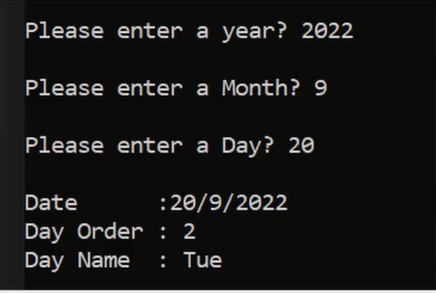

# Problems and Solutions Set 4

## <a href = "https://github.com/Khadijarejjaoui99/CPlusPlus_Problems_and_Solutions/tree/main/CPlusPlus-Problems-and-Solutions/Problems-and-Solutions-Set-4/problem01">Problem 01: Number To Text</a>

Write a program to read a number and print the text of that number.
  

## <a href = "https://github.com/Khadijarejjaoui99/CPlusPlus_Problems_and_Solutions/tree/main/CPlusPlus-Problems-and-Solutions/Problems-and-Solutions-Set-4/problem02">Problem 02: Leap Year</a>

Write a program to check if a year is a leap year or not.
  

## <a href = "https://github.com/Khadijarejjaoui99/CPlusPlus_Problems_and_Solutions/tree/main/CPlusPlus-Problems-and-Solutions/Problems-and-Solutions-Set-4/problem03">Problem 03: Leap Year (One Line of Code)</a>

Solve leap year problem with one line of code only.
  

## <a href = "https://github.com/Khadijarejjaoui99/CPlusPlus_Problems_and_Solutions/tree/main/CPlusPlus-Problems-and-Solutions/Problems-and-Solutions-Set-4/problem04">Problem 04: Number of Days Hours Minutes Seconds in a Year</a>

Write a program to print number of days, hours, minutes, and seconds in a year.
  

## <a href = "https://github.com/Khadijarejjaoui99/CPlusPlus_Problems_and_Solutions/tree/main/CPlusPlus-Problems-and-Solutions/Problems-and-Solutions-Set-4/problem05">Problem 05: Number of Days Hours Minutes Seconds in a month</a>

Write a program to print number of days, hours, minutes, and seconds in a month.
  

## <a href = "https://github.com/Khadijarejjaoui99/CPlusPlus_Problems_and_Solutions/tree/main/CPlusPlus-Problems-and-Solutions/Problems-and-Solutions-Set-4/problem06">Problem 06: Number of Days in a month (Short Logic)</a>

Write a program to print number of days in a certain month.
  

## <a href = "https://github.com/Khadijarejjaoui99/CPlusPlus_Problems_and_Solutions/tree/main/CPlusPlus-Problems-and-Solutions/Problems-and-Solutions-Set-4/problem07">Problem 07: Day Name</a>

Write a program to read a date and print the day name of the week.
  

  

## <a href = "https://github.com/Khadijarejjaoui99/CPlusPlus_Problems_and_Solutions/tree/main/CPlusPlus-Problems-and-Solutions/Problems-and-Solutions-Set-4/problem08">Problem 08: Month Calendar</a>

Write a program to print month calendar.
  

## <a href = "https://github.com/Khadijarejjaoui99/CPlusPlus_Problems_and_Solutions/tree/main/CPlusPlus-Problems-and-Solutions/Problems-and-Solutions-Set-4/problem09">Problem 09: Year Calendar</a>

Write a program to print year calendar.
  

## <a href = "https://github.com/Khadijarejjaoui99/CPlusPlus_Problems_and_Solutions/tree/main/CPlusPlus-Problems-and-Solutions/Problems-and-Solutions-Set-4/problem10">Problem 10: Days from the Beginning of the Year</a>

Write a program to print total days from the beginning of the year.
  

## <a href = "https://github.com/Khadijarejjaoui99/CPlusPlus_Problems_and_Solutions/tree/main/CPlusPlus-Problems-and-Solutions/Problems-and-Solutions-Set-4/problem11">Problem 11: Date from Day Order in a Year</a>

Write a program to print total days from the beginning of the year.
  Take the total days and convert them back to a date.
  

## <a href = "https://github.com/Khadijarejjaoui99/CPlusPlus_Problems_and_Solutions/tree/main/CPlusPlus-Problems-and-Solutions/Problems-and-Solutions-Set-4/problem12">Problem 12: Add Days to Date</a>

Write a program to read date and read how many days to add to add to it, then print result on the screen.
  

