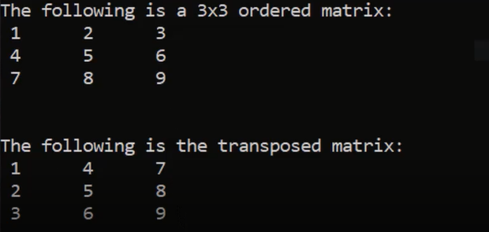
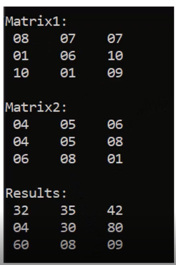
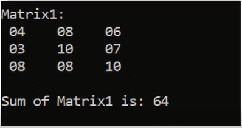
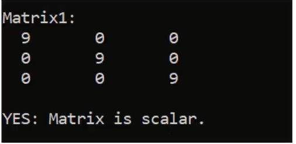
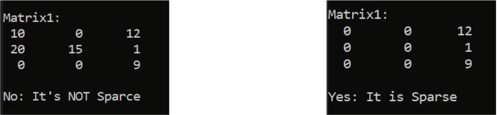
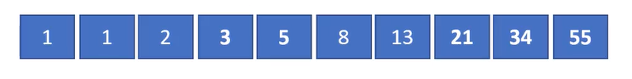
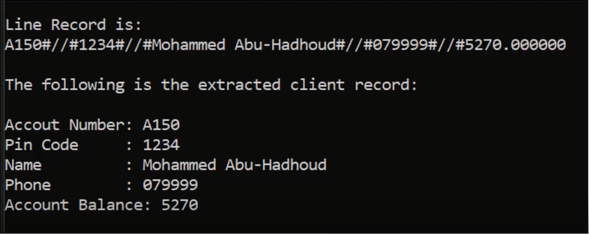
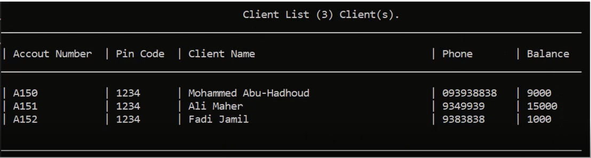
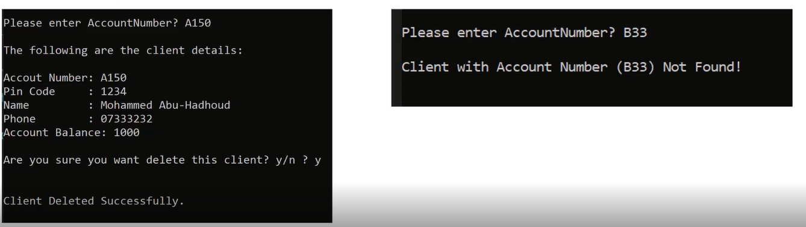
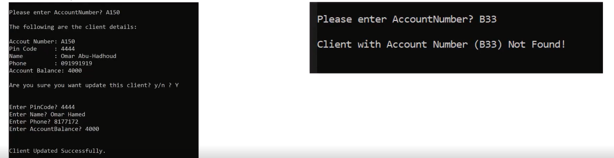

# Problems and Solutions Set 1

## <a href = "https://github.com/Khadijarejjaoui99/CPlusPlus_Problems_and_Solutions/tree/main/CPlusPlus-Problems-and-Solutions/Problems-and-Solutions-Set-1/problem01">Problem #01: Print your name</a>

Write a program to print your name on the screen.

## <a href = "https://github.com/Khadijarejjaoui99/CPlusPlus_Problems_and_Solutions/tree/main/CPlusPlus-Problems-and-Solutions/Problems-and-Solutions-Set-1/problem02">Problem #02: Read name and print it</a>

Write a program to ask the user to enter his/her name and print it on the screen

## <a href = "https://github.com/Khadijarejjaoui99/CPlusPlus_Problems_and_Solutions/tree/main/CPlusPlus-Problems-and-Solutions/Problems-and-Solutions-Set-1/problem03">Problem #03: Check Odd or Even</a>

Write a program to ask the user to enter a number, then print "Odd" if it is odd,
or "Even" if it is even.

## <a href = "https://github.com/Khadijarejjaoui99/CPlusPlus_Problems_and_Solutions/tree/main/CPlusPlus-Problems-and-Solutions/Problems-and-Solutions-Set-1/problem04">Problem #04: Hire a driver case I</a>

Write a program that ask the user to enter his/her:
  - Age
  - Driving license.
 Then print "Hired" if his/her age is greater than 21 years old and she/he has a
driving license, otherwise print "Rejected".

## <a href = "https://github.com/Khadijarejjaoui99/CPlusPlus_Problems_and_Solutions/tree/main/CPlusPlus-Problems-and-Solutions/Problems-and-Solutions-Set-1/problem05">Problem #05: Hire a driver case II</a>

Write a program that ask the user to enter his/her:
  - Age
  - Has driving license.
  - Has recommendation
 Then print "Hired" if s/he has recommendations or if his/her age is greater than
21 years old and she/he has a driving license, otherwise print "Rejected".

## <a href = "https://github.com/Khadijarejjaoui99/CPlusPlus_Problems_and_Solutions/tree/main/CPlusPlus-Problems-and-Solutions/Problems-and-Solutions-Set-1/problem06">Problem #06: Full Name</a>

Write a program that ask the user to enter his/her:
  - First name
  - Last name
  Then print the full name on the screen.
  Example Input:
  Khadija
  Rejjaoui
  Output:
  Khadija Rejjaoui

## <a href = "https://github.com/Khadijarejjaoui99/CPlusPlus_Problems_and_Solutions/tree/main/CPlusPlus-Problems-and-Solutions/Problems-and-Solutions-Set-1/problem07">Problem #07: Half number</a>

Write a program that ask the user to enter a number, then print "Half of (number) is (???)"on the screen.
 Example Input:
 50
 Output:
 Half of 50 is 25

## <a href = "https://github.com/Khadijarejjaoui99/CPlusPlus_Problems_and_Solutions/tree/main/CPlusPlus-Problems-and-Solutions/Problems-and-Solutions-Set-1/problem08">Problem #08: Pass/Fail</a>

Write a program that ask the user to enter a mark, then print "Pass" if the mark
is greater or equal to 50 , otherwise print fail
 Example Input:
 80
 Output:
 Pass

## <a href = "https://github.com/Khadijarejjaoui99/CPlusPlus_Problems_and_Solutions/tree/main/CPlusPlus-Problems-and-Solutions/Problems-and-Solutions-Set-1/problem09">Problem #09: Sum of 3 numbers</a>

Write a program to ask the user to enter 3 numbers, then print sum of the
entered numbers.
 Example Input:
 10
 30
 5
 Output:
 45

## <a href = "https://github.com/Khadijarejjaoui99/CPlusPlus_Problems_and_Solutions/tree/main/CPlusPlus-Problems-and-Solutions/Problems-and-Solutions-Set-1/problem10">Problem #10: Average of 3 marks</a>

Write a program to ask the user to enter 3, then print average of the entered
marks.
 Example Input:
 50
 60
 70
 Output:
 60

## <a href = "https://github.com/Khadijarejjaoui99/CPlusPlus_Problems_and_Solutions/tree/main/CPlusPlus-Problems-and-Solutions/Problems-and-Solutions-Set-1/problem11">Problem #11: Average Pass/Fail</a>

Write a program to ask the user to enter 3, then print average of the entered
average, if the average >= 50 print "Pass" otherwise print "Fail" .
 Example Input:
 50
 60
 70
 Output:
 60
 "Pass"

## <a href = "https://github.com/Khadijarejjaoui99/CPlusPlus_Problems_and_Solutions/tree/main/CPlusPlus-Problems-and-Solutions/Problems-and-Solutions-Set-1/problem12">Problem #12: Max of 2 numbers</a>

Write a program to ask the user to enter 2 numbers, then print the max number.
 Example Input:
 20
 100
 Output:
 100

## <a href = "https://github.com/Khadijarejjaoui99/CPlusPlus_Problems_and_Solutions/tree/main/CPlusPlus-Problems-and-Solutions/Problems-and-Solutions-Set-1/problem13">Problem #13: Max of 3 numbers</a>

Write a program to ask the user to enter 3 numbers, then print the max number.
 Example Input:
 20
 100
 300
 Output:
 300

## <a href = "https://github.com/Khadijarejjaoui99/CPlusPlus_Problems_and_Solutions/tree/main/CPlusPlus-Problems-and-Solutions/Problems-and-Solutions-Set-1/problem14">Problem #14: Swap numbers</a>

Write a program to ask the user to enter 2 numbers, then print them, after that
swap them and print them again

## <a href = "https://github.com/Khadijarejjaoui99/CPlusPlus_Problems_and_Solutions/tree/main/CPlusPlus-Problems-and-Solutions/Problems-and-Solutions-Set-1/problem15">Problem #15: Rectangle Area I</a>

Write a program to calculate rectangle area and print it on the screen.
 Example Input:
 5
 10
 Output:
 50
 

## <a href = "https://github.com/Khadijarejjaoui99/CPlusPlus_Problems_and_Solutions/tree/main/CPlusPlus-Problems-and-Solutions/Problems-and-Solutions-Set-1/problem16">Problem #16: Rectangle Area II</a>

Write a program to calculate rectangle area through diagonal and side area of
rectangle and print it on the screen.
 Example Input:
 5
 40
 Output:
 198.431
 

## <a href = "https://github.com/Khadijarejjaoui99/CPlusPlus_Problems_and_Solutions/tree/main/CPlusPlus-Problems-and-Solutions/Problems-and-Solutions-Set-1/problem17">Problem #17: Triangle Area</a>

Write a program to calculate triangle area then print it on the screen.
 Example Input:
 10
 8
 Output:
 40
 

## <a href = "https://github.com/Khadijarejjaoui99/CPlusPlus_Problems_and_Solutions/tree/main/CPlusPlus-Problems-and-Solutions/Problems-and-Solutions-Set-1/problem18">Problem #18: Circle Area I</a>

Write a program to calculate circle area then print it on the screen.
 Example Input:
 5
 Output:
 78.54
 

## <a href = "https://github.com/Khadijarejjaoui99/CPlusPlus_Problems_and_Solutions/tree/main/CPlusPlus-Problems-and-Solutions/Problems-and-Solutions-Set-1/problem19">Problem #19: Circle Area II</a>

Write a program to calculate circle area through diameter, then print it on the
screen.
 Example Input:
 10
 Output:
 78.54
 

## <a href = "https://github.com/Khadijarejjaoui99/CPlusPlus_Problems_and_Solutions/tree/main/CPlusPlus-Problems-and-Solutions/Problems-and-Solutions-Set-1/problem20">Problem #20: Circle Area III</a>

Write a program to calculate circle area inscribed in a square, then print it on the
screen.
 Example Input:
 10
 Output:
 78.54
 

## <a href = "https://github.com/Khadijarejjaoui99/CPlusPlus_Problems_and_Solutions/tree/main/CPlusPlus-Problems-and-Solutions/Problems-and-Solutions-Set-1/problem21">Problem #21: Circle Area IV</a>

Write a program to calculate circle area along the circumference, then print it on
the screen.
 Example Input:
 20
 Output:
 31.847
 

## <a href = "https://github.com/Khadijarejjaoui99/CPlusPlus_Problems_and_Solutions/tree/main/CPlusPlus-Problems-and-Solutions/Problems-and-Solutions-Set-1/problem22">Problem #22: Circle Area V</a>

Write a program to calculate circle area inscribed in an isosceles triangle, then
print it on the screen.
 Example Input:
 20
 10
 Output:
 47.124
 

## <a href = "https://github.com/Khadijarejjaoui99/CPlusPlus_Problems_and_Solutions/tree/main/CPlusPlus-Problems-and-Solutions/Problems-and-Solutions-Set-1/problem23">Problem #23: Circle Area VI</a>

Write a program to calculate circle area circle described around an arbitrary
triangle, then print it on the screen.
 Example Input:
 5
 6
 7
 Output:
 40.088
 

## <a href = "https://github.com/Khadijarejjaoui99/CPlusPlus_Problems_and_Solutions/tree/main/CPlusPlus-Problems-and-Solutions/Problems-and-Solutions-Set-1/problem24">Problem #24: Validate Age Between 18 and 45</a>

Write a program to ask the user to enter his/ her age. If the age is between 18
and 45 print "Valid Age" otherwise print "Invalid Age"
 Example Input:
 30
 Output:
 Valid Age

## <a href = "https://github.com/Khadijarejjaoui99/CPlusPlus_Problems_and_Solutions/tree/main/CPlusPlus-Problems-and-Solutions/Problems-and-Solutions-Set-1/problem25">Problem #25: Read Until Age Between 18 and 45</a>

Write a program to ask the user to enter his/ her age. If the age is between 18
and 45 print "Valid Age" otherwise print "Invalid Age" and re-ask user to enter a
valid age.

## <a href = "https://github.com/Khadijarejjaoui99/CPlusPlus_Problems_and_Solutions/tree/main/CPlusPlus-Problems-and-Solutions/Problems-and-Solutions-Set-1/problem26">Problem #26: Print Numbers from 1 to N</a>

Write a program that print from 1 to N.
 Example input:
 5
 Output:
 1
 2
 3
 4
 5

## <a href = "https://github.com/Khadijarejjaoui99/CPlusPlus_Problems_and_Solutions/tree/main/CPlusPlus-Problems-and-Solutions/Problems-and-Solutions-Set-1/problem27">Problem #27: Print Numbers from N to 1</a>

Write a program that print from N to 1.
 Example input:
 5
 Output:
 5
 4
 3
 2
 1

## <a href = "https://github.com/Khadijarejjaoui99/CPlusPlus_Problems_and_Solutions/tree/main/CPlusPlus-Problems-and-Solutions/Problems-and-Solutions-Set-1/problem28">Problem #28: Print Sum Odd Numbers from 1 to N</a>

Write a program to sum odd numbers from 1 to N.
 Example input:
 5
 Output:
 9

## <a href = "https://github.com/Khadijarejjaoui99/CPlusPlus_Problems_and_Solutions/tree/main/CPlusPlus-Problems-and-Solutions/Problems-and-Solutions-Set-1/problem29">Problem #29: Print Sum Even Numbers from 1 to N</a>

Write a program to sum even numbers from 1 to N.
 Example input:
 5
 Output:
 6

## <a href = "https://github.com/Khadijarejjaoui99/CPlusPlus_Problems_and_Solutions/tree/main/CPlusPlus-Problems-and-Solutions/Problems-and-Solutions-Set-1/problem30">Problem #30: Sum 1 To N</a>

You are tasked with creating a program that calculates the sum of numbers based on user input. The program should provide the user with options to choose what type of numbers they want to include in the sum: all numbers, even numbers, or odd numbers. The program should then calculate the sum based on the selected option and display the result.

 Requirements:
 1. The program should prompt the user to enter a number.
 2. The program should provide the following options for the user to select what type of numbers they want to include in the sum:
 a. Sum All Numbers: Calculate the sum of all numbers from 1 to the user-entered number.
 b. Sum Even Numbers: Calculate the sum of all even numbers from 1 to the user-entered number.
 c. Sum Odd Numbers: Calculate the sum of all odd numbers from 1 to the user-entered number.
 3. The program should display appropriate messages to inform the user of their selections and the calculated sum.

## <a href = "https://github.com/Khadijarejjaoui99/CPlusPlus_Problems_and_Solutions/tree/main/CPlusPlus-Problems-and-Solutions/Problems-and-Solutions-Set-1/problem31">Problem #31: Factorial of N!</a>

Write a program to calculate Factorial of N!
 Example input:
 6
 Output:
 720

## <a href = "https://github.com/Khadijarejjaoui99/CPlusPlus_Problems_and_Solutions/tree/main/CPlusPlus-Problems-and-Solutions/Problems-and-Solutions-Set-1/problem32">Problem #32: Power of 2,3,4</a>

Write a program to ask the user to enter a number and print number^2,
number^3, number^4
 Example Input:
 3
 Output:
 9
 27
 81

## <a href = "https://github.com/Khadijarejjaoui99/CPlusPlus_Problems_and_Solutions/tree/main/CPlusPlus-Problems-and-Solutions/Problems-and-Solutions-Set-1/problem33">Problem #33: Power of M</a>

Write a program to ask the user to enter a number and power and print result
 Example Input:
 2
 4
 Output:
 16

## <a href = "https://github.com/Khadijarejjaoui99/CPlusPlus_Problems_and_Solutions/tree/main/CPlusPlus-Problems-and-Solutions/Problems-and-Solutions-Set-1/problem34">Problem #34: Grade A,B,C,D,E,F</a>

Write a program to ask the user to enter his/ her mark and print his/her grade.
 90 - 100 Print A.
 80 - 89 Print B.
 70 - 79 Print C.
 60 - 69 Print D.
 50 - 59 Print E.
 Otherwise Print F.

## <a href = "https://github.com/Khadijarejjaoui99/CPlusPlus_Problems_and_Solutions/tree/main/CPlusPlus-Problems-and-Solutions/Problems-and-Solutions-Set-1/problem35">Problem #35: Commission Percentage</a>

 >= 1000,000 -> percentage is 1%
 > 500K to 1M -> percentage is 2%
 >100K to 500K -> percentage is 3%
 >50K to 100K -> percentage is 5%
 > Otherwise -> percentage 0%
 > Write a program to ask the user to enter TotalSales and print the commission.
 > The commission is calculated as percentage \* the total sale amount.
 Example Input:
 110,000
 Output
 3,300

## <a href = "https://github.com/Khadijarejjaoui99/CPlusPlus_Problems_and_Solutions/tree/main/CPlusPlus-Problems-and-Solutions/Problems-and-Solutions-Set-1/problem36">Problem #36: Piggy Bank Calculator</a>

Write a program to ask the user to enter Pennies, Nickels, Dimes, Quarters,
Dollars. Print the TotalPennies and TotalDollars.
 Penny = 1
 Nickel = 5
 Dime = 10
 Quarter = 25
 Dollar = 100

## <a href = "https://github.com/Khadijarejjaoui99/CPlusPlus_Problems_and_Solutions/tree/main/CPlusPlus-Problems-and-Solutions/Problems-and-Solutions-Set-1/problem37">Problem #37: Simple Calculator</a>

Write a program to ask the user to enter two numbers and operation type.
 "+" Add two numbers
 "-" Subtract two numbers
 "\*" Multiply two numbers
 "/" Divide two numbers

## <a href = "https://github.com/Khadijarejjaoui99/CPlusPlus_Problems_and_Solutions/tree/main/CPlusPlus-Problems-and-Solutions/Problems-and-Solutions-Set-1/problem38">Problem #38: Sum Until -99</a>

Write a program to read numbers from the user and sum them, keep reading
until the user enter -99 then print the sum on the screen.
 10
 20
 -99
 Output:
 30

## <a href = "https://github.com/Khadijarejjaoui99/CPlusPlus_Problems_and_Solutions/tree/main/CPlusPlus-Problems-and-Solutions/Problems-and-Solutions-Set-1/problem39">Problem #39: Is Prime Number</a>

Write a program to read a number and check if it is a prime number or not. Print
"Prime" if it is prime, and "Not Prime" otherwise.
A prime number can only be divided by 1 and itself.
 5
 Output:
 Prime

## <a href = "https://github.com/Khadijarejjaoui99/CPlusPlus_Problems_and_Solutions/tree/main/CPlusPlus-Problems-and-Solutions/Problems-and-Solutions-Set-1/problem40">Problem #40: Pay Remainder</a>

Write a program to read TotalBill and CashPaid and calculate the remainder to
be paid back.
 20
 50
 Output:
 30

## <a href = "https://github.com/Khadijarejjaoui99/CPlusPlus_Problems_and_Solutions/tree/main/CPlusPlus-Problems-and-Solutions/Problems-and-Solutions-Set-1/problem41">Problem #41: Service Fee and Sales Tax </a>

A restaurant charges 10% service fees and 16% sales tax.
Write a program to read BillValue and add service fees and sales tax to it, and
print TotalBill on screen.
 100
 Output:
 127.6

## <a href = "https://github.com/Khadijarejjaoui99/CPlusPlus_Problems_and_Solutions/tree/main/CPlusPlus-Problems-and-Solutions/Problems-and-Solutions-Set-1/problem42">Problem #42: Weeks and Days </a>

Write a program to read NumberOfHours and calculate the number of weeks
and days included in that number.

## <a href = "https://github.com/Khadijarejjaoui99/CPlusPlus_Problems_and_Solutions/tree/main/CPlusPlus-Problems-and-Solutions/Problems-and-Solutions-Set-1/problem43">Problem #43:Task Duration In Seconds</a>

Write a program to calculate the task duration in seconds and print it on the
screen. -> Given the time duration of task in the number of days, hours, minutes,
and seconds.
 example
 2
 5
 45
 35
 Output:
 193,535 Seconds

## <a href = "https://github.com/Khadijarejjaoui99/CPlusPlus_Problems_and_Solutions/tree/main/CPlusPlus-Problems-and-Solutions/Problems-and-Solutions-Set-1/problem44">Problem #44:Seconds to Days Hours Minutes Seconds</a>

Write a program that takes number of seconds as inputs and change it into
days, hours, minutes, and seconds.
 example
 193,535
 Output:
 2:5:45:35

## <a href = "https://github.com/Khadijarejjaoui99/CPlusPlus_Problems_and_Solutions/tree/main/CPlusPlus-Problems-and-Solutions/Problems-and-Solutions-Set-1/problem45">Problem #45: Day Of Week</a>

Write a program to ask the user to enter day number and print the day name.
 1 print Sunday
 2 print Monday
 3 print Tuesday
 4 print Wednesday
 5 print Thursday
 6 print Friday
 7 print Saturday

## <a href = "https://github.com/Khadijarejjaoui99/CPlusPlus_Problems_and_Solutions/tree/main/CPlusPlus-Problems-and-Solutions/Problems-and-Solutions-Set-1/problem46">Problem #46: Months of the year</a>

Write a program to ask the user to enter month number and print the month name.
 1 print January
 2 print February
 3 print March
 4 print April
 5 print May
 6 print June
 7 print July
 8 print August
 9 print September
 10 print October
 11 print November
 12 print December

## <a href = "https://github.com/Khadijarejjaoui99/CPlusPlus_Problems_and_Solutions/tree/main/CPlusPlus-Problems-and-Solutions/Problems-and-Solutions-Set-1/problem47">Problem #47: Print from A to Z</a>

Write a program that prints letters from A to Z.

## <a href = "https://github.com/Khadijarejjaoui99/CPlusPlus_Problems_and_Solutions/tree/main/CPlusPlus-Problems-and-Solutions/Problems-and-Solutions-Set-1/problem48">Problem #48: Loan Instalment Months</a>

Write a program to read a LoanAmount and a MonthlyPayment and calculate
how many months you need to settle the loan
 Example input:
 5000
 500
 Output:
 10 months

## <a href = "https://github.com/Khadijarejjaoui99/CPlusPlus_Problems_and_Solutions/tree/main/CPlusPlus-Problems-and-Solutions/Problems-and-Solutions-Set-1/problem49">Problem #49: Monthly Loan Installment</a>

Write a program to read LoanAmount and ask you how many months you need
to settle the loan, and calculate the monthly installments.
 Example input:
 5000
 10
 Output:
 500

## <a href = "https://github.com/Khadijarejjaoui99/CPlusPlus_Problems_and_Solutions/tree/main/CPlusPlus-Problems-and-Solutions/Problems-and-Solutions-Set-1/problem50">Problem #50: ATM PIN</a>

Write a program to read ATM PIN code from the user, then check if the PIN code
= 1234, then show the balance to the user, otherwise print "Wrong PIN"
Assume user balance is 7800.

## <a href = "https://github.com/Khadijarejjaoui99/CPlusPlus_Problems_and_Solutions/tree/main/CPlusPlus-Problems-and-Solutions/Problems-and-Solutions-Set-1/problem51">Problem #51: ATM PIN 2</a>

Write a program to read ATM PIN code from the user, then check if the PIN code
= 1234, then show the balance to the user, otherwise print "Wrong PIN" and ask
the user to enter the PIN again and make the screen red.
Assume user balance is 7800.

## <a href = "https://github.com/Khadijarejjaoui99/CPlusPlus_Problems_and_Solutions/tree/main/CPlusPlus-Problems-and-Solutions/Problems-and-Solutions-Set-1/problem52">Problem #52: ATM PIN</a>

Write a program to read ATM PIN code from the user, then check if the PIN code
= 1234, then show the balance to the user, otherwise print "Wrong PIN" and ask
the user to enter the PIN again.
Assume user balance is 7800.
Only allow the user to enter the 3 times. If fails, print "Card is Locked"

# Problems and Solutions Set 2

# Problems and Solutions Set 2

## <a href = "https://github.com/Khadijarejjaoui99/CPlusPlus_Problems_and_Solutions/tree/main/Problems-and-Solutions-Set2/problem01" >Problem01: Multiplication Table 1 To 10</a>

Write a program to print the multiplication table as the following:

## <a href = "https://github.com/Khadijarejjaoui99/CPlusPlus_Problems_and_Solutions/tree/main/Problems-and-Solutions-Set2/problem02" >Problem02: Print Prime Numbers From 1 To N</a>

Write a program to print all prime numbers from 1 to N.
  Example Input:
  10
 Output:
 1
 2
 3
 5
 7

## <a href = "https://github.com/Khadijarejjaoui99/CPlusPlus_Problems_and_Solutions/tree/main/Problems-and-Solutions-Set2/problem03" >Problem03:Perfect Number:</a>

Write a program to check if the number is perfect or not.
 Note: Prfect Number = Sum (all divisors).
  Ex: 28 = 1 + 2 + 4 + 7 + 14
  Ex: 6 = 1 + 2 + 3
  Example Input:
  28
  Output:
  28 is perfect
  Example Input:
  12
  Output:
  12 is not perfect

## <a href = "https://github.com/Khadijarejjaoui99/CPlusPlus_Problems_and_Solutions/tree/main/Problems-and-Solutions-Set2/problem04" >Problem04: Perfect Numbers From 1 To N</a>

Write a program to print all perfect numbers from 1 to N.
  Example Input:
  500
 Output:
 6
 28
 496

## <a href = "https://github.com/Khadijarejjaoui99/CPlusPlus_Problems_and_Solutions/tree/main/Problems-and-Solutions-Set2/problem05" >Problem05: Print Digits in Reversed Order:</a>

Write a program to read a number and print it in the reversed order.
  Input:
  1234
 Output:
 4
 3
 2
 1

## <a href = "https://github.com/Khadijarejjaoui99/CPlusPlus_Problems_and_Solutions/tree/main/Problems-and-Solutions-Set2/problem06" >Problem06: Sum all digits:</a>

Write a program to read a number and print the sum of its digits.
  Example Input:
  1234
  Output:
  Sum Of Digits = 10

## <a href = "https://github.com/Khadijarejjaoui99/CPlusPlus_Problems_and_Solutions/tree/main/Problems-and-Solutions-Set2/problem07" >Problem07: Reversed Number</a>

Write a program to read a number and print its reversed.
  Example Input:
  1234
 Output:
 4321

## <a href = "https://github.com/Khadijarejjaoui99/CPlusPlus_Problems_and_Solutions/tree/main/Problems-and-Solutions-Set2/problem08" >Problem08: Digits Frequency</a>

Write a program to read a number and a digit, then print digits frequency in that number.
  Example Input:
  1223222
  2
  Output:
  Digit 2 Frequency is 5 Time(s).

## <a href = "https://github.com/Khadijarejjaoui99/CPlusPlus_Problems_and_Solutions/tree/main/Problems-and-Solutions-Set2/problem09" >Problem09: Digits Frquency</a>

Write a program that reads a number and prints all digits frequencies in that number.
 Input:
 1223222
 Output:
 Digit 1 Frequency is 1 Time(s).
 Digit 2 Frequency is 5 Time(s).
 Digit 3 Frequency is 1 Time(s).

## <a href = "https://github.com/Khadijarejjaoui99/CPlusPlus_Problems_and_Solutions/tree/main/Problems-and-Solutions-Set2/problem10" >Problem10: Print digits in order</a>

Write a program to read a number and print it in order from left to right.
 Example Input:
 1234
 Example Output:
 1
 2
 3
 4

## <a href = "https://github.com/Khadijarejjaoui99/CPlusPlus_Problems_and_Solutions/tree/main/Problems-and-Solutions-Set2/problem11" >Problem11: Palindrome Number</a>

Write a program to read a number and check if it palindrome.
 Note: Palindrom is a number that reads the same from the right and left
 Example Input:
 12321
 Ouput:
 No, it is not a Plaindrome Number.
 Example Input 2:
 1234
 Ouput:
 Yes, it is a Plaindrome Number.

## <a href = "https://github.com/Khadijarejjaoui99/CPlusPlus_Problems_and_Solutions/tree/main/Problems-and-Solutions-Set2/problem12" >Problem12: Inverted Number Pattern:

</a>
Write a program to read a number and print inverted pattern as follows:
  Input:
  3
  Output
  333
  22
  1

## <a href = "https://github.com/Khadijarejjaoui99/CPlusPlus_Problems_and_Solutions/tree/main/Problems-and-Solutions-Set2/problem13" >Problem13: Number Pattern</a>

Write a program to read a number and print number pattern as follows:
  Input:
  3
  Output
  1
  22
  333

## <a href = "https://github.com/Khadijarejjaoui99/CPlusPlus_Problems_and_Solutions/tree/main/Problems-and-Solutions-Set2/problem14" >Problem14: Inverted Letter Pattern:</a>

Write a program to read a number and print inverted pattern as follows:
  Input:
  3
  Output
  CCC
  BB
  A

## <a href = "https://github.com/Khadijarejjaoui99/CPlusPlus_Problems_and_Solutions/tree/main/Problems-and-Solutions-Set2/problem15" >Problem15: Letter Pattern:</a>

Write a program to read a number and print inverted pattern as follows:
  Input:
  3
  Output
  A
  BB
  CCC

## <a href = "https://github.com/Khadijarejjaoui99/CPlusPlus_Problems_and_Solutions/tree/main/Problems-and-Solutions-Set2/problem16" >Problem16: All Words From AAA To ZZZ:</a>

Write a program to print all the words from AAA to ZZZ.
  Output
  AAA
  AAB
  AAC
  .
  .
  .
  ZZZ

## <a href = "https://github.com/Khadijarejjaoui99/CPlusPlus_Problems_and_Solutions/tree/main/Problems-and-Solutions-Set2/problem17" > Problem17: Guess a 3-Letters Password</a>

</a>
Write a program to guess 3-Letters Password (all capital)
 Example Input:
 AAF
 Ouput:
 Trial [1]: AAA
 Trial [2]: AAB
 Trial [3]: AAC
 Trial [4]: AAD
 Trial [5]: AAE
 Trial [6]: AAF
 Password is AAF
 Found After 6 Trial(s)

## <a href = "https://github.com/Khadijarejjaoui99/CPlusPlus_Problems_and_Solutions/tree/main/Problems-and-Solutions-Set2/problem18" >Problem18: Encryption Decryption Name:</a>

Write a program to raed a name and encrypt it then decrypt it
  Input:
  Khadija
  Output:
  Text Before Encryption = Khadija
  Text After Encryption = Mjcfklc
  Text After Decryption = Khadija

## <a href = "https://github.com/Khadijarejjaoui99/CPlusPlus_Problems_and_Solutions/tree/main/Problems-and-Solutions-Set2/problem19" >Problem19: Random 3 Numbers From 1 To 10</a>

Write a program to print 3 random number from 1 to 10
 Output:
 9
 5
 3

## <a href = "https://github.com/Khadijarejjaoui99/CPlusPlus_Problems_and_Solutions/tree/main/Problems-and-Solutions-Set2/problem20" >Problem20: Small Letter, Capital Letter, Special Character, Digit</a>

Write a program to print random Small Letter, Capital Letter, Special Character, Digit
  Example Output:
  a
  G
  $
  3

## <a href = "https://github.com/Khadijarejjaoui99/CPlusPlus_Problems_and_Solutions/tree/main/Problems-and-Solutions-Set2/problem21" >Problem21: Generate Random keys:</a>

write a program to generate random keys.
 Input:
 5
 Output:
 Key [1]: WJWN-ESSS-IIWU-JEEY
 Key [2]: XUSR-AYAY-JDIZ-QQHC
 Key [3]: POBM-EOGV-ZFEL-UPQS
 Key [4]: NIOL-HDEY-BIHB-TKVM
 Key [5]: OVKK-UQBX-OLGF-IJMX

## <a href = "https://github.com/Khadijarejjaoui99/CPlusPlus_Problems_and_Solutions/tree/main/Problems-and-Solutions-Set2/problem22" >Problem22: Repeated Element Count In An Array</a>

Write a program to N numbers and store them in an array the print all array elements and ask for a number to check, then print how many times that number is repeated in an array.
 Example:
 How many elements do you want to enter:
 5
 Enter Array Elements:
 Element [1]: 1
 Element [2]: 1
 Element [3]: 1
 Element [4]: 2
 Element [5]: 3
 Please enter the number you want to check:
 1
 Original Array: 1 1 1 2 3
 1 is repeated 3 time(s)

## <a href = "https://github.com/Khadijarejjaoui99/CPlusPlus_Problems_and_Solutions/tree/main/Problems-and-Solutions-Set2/problem23" >Problem23: Fill Array With Random Numbers From 1 To 100 </a>

Write a program to N numbers and fill the array with random numbers from 1 to 100 and print the array.
 Example:
 How many elements do you want in the array:
 10
 Array Elements: 71 56 45 27 56 96 87 42 90 13

## <a href = "https://github.com/Khadijarejjaoui99/CPlusPlus_Problems_and_Solutions/tree/main/Problems-and-Solutions-Set2/problem24" >Problem24: Find Maximum Number In An Array:</a>

Write a program to N numbers and fill the array with random numbers from 1 to 100 the print max element
 Example:
 How many elements do you want in the array:
 10
 Array Elements: 38 30 100 100 17 99 46 91 55 31
 Max Number is: 100

## <a href = "https://github.com/Khadijarejjaoui99/CPlusPlus_Problems_and_Solutions/tree/main/Problems-and-Solutions-Set2/problem25" >Problem25: Find Minimum Number In An Array:</a>

Write a program to N numbers and fill the array with random numbers from 1 to 100 the print min element
 Example:
 How many elements do you want in the array:
 10
 Array Elements: 38 30 100 100 17 99 46 91 55 31
 Min Number is: 17

## <a href = "https://github.com/Khadijarejjaoui99/CPlusPlus_Problems_and_Solutions/tree/main/Problems-and-Solutions-Set2/problem26" >Problem26: Sum of Random Array</a>

Write a program to N numbers and fill the array with random numbers from 1 to 100 then print sum of all elements
 Example:
 How many elements do you want in the array (1 to 100):
 10
 Array Elements are: 11 85 36 95 72 69 76 23 35 96
 Sum of All Numbers is: 598

## <a href = "https://github.com/Khadijarejjaoui99/CPlusPlus_Problems_and_Solutions/tree/main/Problems-and-Solutions-Set2/problem27" >Problem27: Average of Random Array</a>

Write a program to N numbers and fill the array with random numbers from 1 to 100 then print Average of elements
 Example:
 How many elements do you want in the array (1 to 100):
 10
 Array elements are: 83 58 66 19 64 85 76 83 37 16
 Average of All Numbers is: 58.7

## <a href = "https://github.com/Khadijarejjaoui99/CPlusPlus_Problems_and_Solutions/tree/main/Problems-and-Solutions-Set2/problem28" >Problem28: Copy Array</a>

Write a program to fill array of max size of 100 with random numbers from 1 to 100 then copy it to another array and print them.
 Example:
 How many elements do you want in the array (1 to 100):
 10
 Array Elements are: 24 56 77 23 15 88 84 6 82 34
 Array Copy Elements are: 24 56 77 23 15 88 84 6 82 34

## <a href = "https://github.com/Khadijarejjaoui99/CPlusPlus_Problems_and_Solutions/tree/main/Problems-and-Solutions-Set2/problem29" >Problem29: Copy Only Prime Elements In An Array </a>

Write a program to fill array of max size of 100 with random numbers from 1 to 100 then copy only prime numbers to another array and print them.
 Example:
 How many elements do you want in the array (1 to 100):
 10
 Array Elements are: 12 100 91 75 72 97 21 22 8 25
 Array Copy Prime Elements are: 97

## <a href = "https://github.com/Khadijarejjaoui99/CPlusPlus_Problems_and_Solutions/tree/main/Problems-and-Solutions-Set2/problem30" >Problem30: Sum TWO Arrays </a>

Write a program to fill two arrays of max size of 100 with random numbers from 1 to 100 then Sum their elements in a third array and print them.
 Example:
 How many elements do you want in the array (1 to 100):
 10
 Array 1 Elements:
 31 91 21 84 86 27 2 97 2 72
 Array 2 Elements:
 21 87 40 47 100 19 87 68 34 57
 Sum of Array 1 and Array 2:
 52 178 61 131 186 46 89 165 36 129

## <a href = "https://github.com/Khadijarejjaoui99/CPlusPlus_Problems_and_Solutions/tree/main/Problems-and-Solutions-Set2/problem31" >Problem31: Shuffle Array</a>

Write a program to fill array with ordered numbers from 1 to N, then print it. After that shuffle the array and print it after shuffling.
 Example:
 How many elements do you want in the array (1 to 100):
 10
 Array Before Shuffle:
 1 2 3 4 5 6 7 8 9 10
 Array After Shuffle:
 1 2 10 4 5 3 7 6 9 8

## <a href = "https://github.com/Khadijarejjaoui99/CPlusPlus_Problems_and_Solutions/tree/main/Problems-and-Solutions-Set2/problem32" >Problem32: Copy Array In Reversed Order </a>

Write a program to fill array of max size of 100 with random numbers from 1 to 100 then copy it to another array in reverse and print them.
 Example:
 How many elements do you want in the array (1 to 100):
 10
 Array 1 Elements are:
 68 34 66 5 63 62 70 54 33 65
 Reversed Array Elements are:
 65 33 54 70 62 63 5 66 34 68

## <a href = "https://github.com/Khadijarejjaoui99/CPlusPlus_Problems_and_Solutions/tree/main/Problems-and-Solutions-Set2/problem33" >Problem33: Fill Array with Keys</a>

Write a program to read how many keys to generate and fill array with then the print the array.
 Example:
 How many keys do you want to generate(1, 100):
 5
 Array[0]: KFBS-LVZP-ZYNU-AHOM
 Array[1]: OIHC-QKLY-TAJG-TYSR
 Array[2]: EACO-IWMX-JRQX-PIKL
 Array[3]: CWNF-AIAW-KJEI-BIBW
 Array[4]: UUVK-PKKL-WFBV-VJYX

## <a href = "https://github.com/Khadijarejjaoui99/CPlusPlus_Problems_and_Solutions/tree/main/Problems-and-Solutions-Set2/problem34" >Problem34: Find array index</A>

rite a program to fill array of max size of 100 with random numbers from 1 to 100, read a number and print its index if found.
 Example 1:
 How many elements do you want in the array
 10
 Array Elements are:
 20 5 65 91 42 59 85 44 80 63
 Please enter a number to search for (1 to 100):
 91
 Number you are looking for is: 91
 The number found at position: 3
 The number found at order: 4
 Example 2:
 How many elements do you want in the array
 12
 Array Elements are:
 68 22 60 65 84 44 40 26 46 79 70 76
 Please enter a number to search for (1 to 100):
 100
 Number you are looking for is: 100
 The number is not found :(

## <a href = "https://github.com/Khadijarejjaoui99/CPlusPlus_Problems_and_Solutions/tree/main/Problems-and-Solutions-Set2/problem35" >Problem35: Check Number In Array</a>

Write a program to fill array of max size of 100 with random numbers from 1 to 100, read a number and print if found or not (use the function FindNumberIndex() used in prev problem)
 Example 1:
 How many numbers do you want in the array:
 11
 Array Elements are:
 42 76 1 2 13 84 34 53 58 30 73
 Please enter a number to search for (1 to 100):
 2
 Number you are looking for is: 2
 Yes, The number is Found

 Example 2:
 How many numbers do you want in the array:
 4
 Array Elements are:
 38 20 8 8
 Please enter a number to search for (1 to 100):
 10
 Number you are looking for is: 10
 No, The number is Not Found

## <a href = "https://github.com/Khadijarejjaoui99/CPlusPlus_Problems_and_Solutions/tree/main/Problems-and-Solutions-Set2/problem36" >Problem36: Semi Dynamic Array</a>

Write a program to dynamically read numbers from the user and add them to the array, max size of array is 100, allocate semi dynamic array length
 Example:
 Please enter a number: 10
 Do you want to add more numbers? [0]: No, [1]:Yes: 1
 Please enter a number: 20
 Do you want to add more numbers? [0]: No, [1]:Yes: 1
 Please enter a number: 30
 Do you want to add more numbers? [0]: No, [1]:Yes: 0
 Array Length: 3
 Array Elements: 10 20 30

## <a href = "https://github.com/Khadijarejjaoui99/CPlusPlus_Problems_and_Solutions/tree/main/Problems-and-Solutions-Set2/problem37" >Problem37: Copy Array Using AddArrayElement functions</a>

Write a program to fill array of max size of 100 with random numbers from 1 to 100 then copy it to another array using AddArrayElement() used in the prev problem and print them.
 Example:
 How many elements do you want in the array (1 to 100):
 10
 Array 1 Elements: 29 54 94 11 5 18 1 100 18 10
 Array 2 Elements: 29 54 94 11 5 18 1 100 18 10

## <a href = "https://github.com/Khadijarejjaoui99/CPlusPlus_Problems_and_Solutions/tree/main/Problems-and-Solutions-Set2/problem38" >Problem38: Copy Only Odd Numbers Using AddArrayElement functions</a>

Write a program to fill array of max size of 100 with random numbers from 1 to 100 then copy only odd numbers to another array using AddArrayElement() used in the prev problem and print them.
 Example:
 How many elements do you want in the array (1 to 100):
 10
 Array 1 Elements are: 24 11 2 32 87 80 61 64 53 93
 Array 2 Odd Elements are: 11 87 61 53 93

## <a href = "https://github.com/Khadijarejjaoui99/CPlusPlus_Problems_and_Solutions/tree/main/Problems-and-Solutions-Set2/problem39" >Problem39: Copy Only Prime Numbers Using AddArrayElement function</a>

Write a program to fill array of max size of 100 with random numbers from 1 to 100 then copy only prime numbers to another array using AddArrayElement() used in the prev problem and print them.
 Example:
 How many elements do you want in the array (1 to 100):
 10
 Array 1 Elements are: 8 86 81 18 23 71 49 14 49 74
 Array 2 Prime Elements are: 23 71

## <a href = "https://github.com/Khadijarejjaoui99/CPlusPlus_Problems_and_Solutions/tree/main/Problems-and-Solutions-Set2/problem40" >Problem40: Copy Only Distinct Numbers Using AddArrayElement function</a>

Write a program to copy only Distinct numbers to another array using AddArrayElement() used in the prev problem and print them.
 Example:
 How many numbers do you want to enter(1 to 100):
 5
 Please enter number 1:
 10
 Please enter number 2:
 10
 Please enter number 3:
 20
 Please enter number 4:
 20
 Please enter number 5:
 30
 Array 1 Elements:
 10 10 20 20 30  
 Array 2 Elements:
 10 20 30

## <a href = "https://github.com/Khadijarejjaoui99/CPlusPlus_Problems_and_Solutions/tree/main/Problems-and-Solutions-Set2/problem41" >Problem41: Palindrome Array</a>

Write a program to check array if palindrome or not.
 Example:
 How many numbers do you want to enter:
 6
 Please enter number 1: 10
 Please enter number 2: 20
 Please enter number 3: 30
 Please enter number 4: 30
 Please enter number 5: 20
 Please enter number 6: 10
 Array Elements are: 10 20 30 30 20 10
 Yes, Array is Palindrome

## <a href = "https://github.com/Khadijarejjaoui99/CPlusPlus_Problems_and_Solutions/tree/main/Problems-and-Solutions-Set2/problem42" >Problem42: Odd Numbers Count In Array</a>

Write a program to fill array of max size of 100 with random numbers from 1 to 100 then count number of odd numbers in the array.
 Example:
 How many numbers do you want to enter (1 to 100):
 10
 Array Elements are: 43 21 94 3 42 42 71 12 58 39
 Odd Numbers Count is: 5

## <a href = "https://github.com/Khadijarejjaoui99/CPlusPlus_Problems_and_Solutions/tree/main/Problems-and-Solutions-Set2/problem43" >Problem43: Even Numbers Count In Array</a>

Write a program to fill array of max size of 100 with random numbers from 1 to 100 then count number of Even numbers in the array.
 Example:
 How many numbers do you want to enter (1 to 100):
 10
 Array Elements are: 78 49 69 28 93 20 45 35 82 80
 Even Numbers Count is: 5

## <a href = "https://github.com/Khadijarejjaoui99/CPlusPlus_Problems_and_Solutions/tree/main/Problems-and-Solutions-Set2/problem44" >Problem44: positive Numbers Count In Array</a>

Write a program to fill array of max size of 100 with random numbers from -100 to 100 then count number of positive numbers in the array.
 Example:
 How many numbers do you want to enter (1 to 100):
 20
 Array Elements are: -51 -65 -47 80 52 94 -33 -84 -34 21 89 15 80 -44 9 -90 -14 -50 -90 -95
 Positive Numbers Count is: 8

## <a href = "https://github.com/Khadijarejjaoui99/CPlusPlus_Problems_and_Solutions/tree/main/Problems-and-Solutions-Set2/problem45" >Problem45: Negative Numbers Count In Array</a>

Write a program to fill array of max size of 100 with random numbers from -100 to 100 then count number of Negative numbers in the array.
 Example:
 How many numbers do you want to enter (1 to 100):
 10
 Array Elements are: -16 -87 -46 47 5 96 -20 2 74 61
 Negative Numbers Count is: 4

## <a href = "https://github.com/Khadijarejjaoui99/CPlusPlus_Problems_and_Solutions/tree/main/Problems-and-Solutions-Set2/problem46" >Problem46: abs function</a>

Write a program to print abs of numbers, don't use built-in abs function.
 Example:
 Please enter a number:
 -30
 My abs Result : 30
 C++ abs Result: 30

## <a href = "https://github.com/Khadijarejjaoui99/CPlusPlus_Problems_and_Solutions/tree/main/Problems-and-Solutions-Set2/problem47" >Problem47: round() function</a>

Write a program to print round of numbers, don't use built-in round() function.
 Example:
 Please enter a number:
 10.5
 My round Result : 11
 C++ round Result: 11

## <a href = "https://github.com/Khadijarejjaoui99/CPlusPlus_Problems_and_Solutions/tree/main/Problems-and-Solutions-Set2/problem48" >Problem48: floor() function</a>

Write a program to print floor of numbers, don't use built-in floor() function.
 Example:
 Please enter a number:
 10.5
 My floor Result : 10
 C++ floor Result: 10

## <a href = "https://github.com/Khadijarejjaoui99/CPlusPlus_Problems_and_Solutions/tree/main/Problems-and-Solutions-Set2/problem49" >Problem49: ceil() function</a>

Write a program to print ceil of numbers, don't use built-in ceil() function.
 Example:
 Please enter a number:
 -10.2
 My ceil Result : -10
 C++ ceil Result: -10

## <a href = "https://github.com/Khadijarejjaoui99/CPlusPlus_Problems_and_Solutions/tree/main/Problems-and-Solutions-Set2/problem50" >Problem50: sqrt() function</a>

Write a program to print sqrt of numbers, don't use built-in sqrt() function.
 Example:
 Please enter a number:
 9
 My sqrt Result : 3
 C++ sqrt Result: 3

# Problems and Solutions Set 3

## <a href = "https://github.com/Khadijarejjaoui99/CPlusPlus_Problems_and_Solutions/tree/main/CPlusPlus-Problems-and-Solutions/Problems-and-Solutions-Set-3/problem01">Problem 01: 3x3 Random Matrix </a>

Write a program to fill a 3x3 matrix with random numbers from 1 to 100.
   

## <a href="https://github.com/Khadijarejjaoui99/CPlusPlus_Problems_and_Solutions/tree/main/CPlusPlus-Problems-and-Solutions/Problems-and-Solutions-Set-3/problem02">Problem 02: Sum Each Row </a>

Write a program to fill a 3x3 matrix with random numbers from 1 to 100. And print the sum of each row.
   

## <a href="https://github.com/Khadijarejjaoui99/CPlusPlus_Problems_and_Solutions/tree/main/CPlusPlus-Problems-and-Solutions/Problems-and-Solutions-Set-3/problem03">Problem 03: Sum Each Row in Matrix </a>

Write a program to fill a 3x3 matrix with random numbers from 1 to 100. Then sum each row and store the result in array.
   

## <a href="https://github.com/Khadijarejjaoui99/CPlusPlus_Problems_and_Solutions/tree/main/CPlusPlus-Problems-and-Solutions/Problems-and-Solutions-Set-3/problem04">Problem 04: Sum Each Colomun </a>

Write a program to fill a 3x3 matrix with random numbers from 1 to 100. And print the sum of each colomun.
   

## <a href="https://github.com/Khadijarejjaoui99/CPlusPlus_Problems_and_Solutions/tree/main/CPlusPlus-Problems-and-Solutions/Problems-and-Solutions-Set-3/problem05">Problem 05: Sum Each Colomun In Another Array </a>

Write a program to fill a 3x3 matrix with random numbers from 1 to 100. Then sum each column and store the result in array.
   

## <a href="https://github.com/Khadijarejjaoui99/CPlusPlus_Problems_and_Solutions/tree/main/CPlusPlus-Problems-and-Solutions/Problems-and-Solutions-Set-3/problem06">Problem 06: 3X3 Ordered Matrix: </a>

Write a program to fill a 3x3 matrix with Ordered numbers.
   

## <a href="https://github.com/Khadijarejjaoui99/CPlusPlus_Problems_and_Solutions/tree/main/CPlusPlus-Problems-and-Solutions/Problems-and-Solutions-Set-3/problem07">Problem 07: 3X3 Transposed Matrix: </a>

Write a program to fill a 3x3 matrix with Ordered numbers, and print it, then transpose the matrix and print it.
   

## <a href="https://github.com/Khadijarejjaoui99/CPlusPlus_Problems_and_Solutions/tree/main/CPlusPlus-Problems-and-Solutions/Problems-and-Solutions-Set-3/problem08">Problem 08: Multiply Two 3x3 Matrices: </a>

Fill two matrices with random numbers from 1 to 10. Then multiply them into a 3rd matrix and print it.
   

## <a href="https://github.com/Khadijarejjaoui99/CPlusPlus_Problems_and_Solutions/tree/main/CPlusPlus-Problems-and-Solutions/Problems-and-Solutions-Set-3/problem09">Problem 09: Print Middle Row And Middle Column: </a>

Fill a matrix with random numbers from 1 to 10. Then print middle row and middle column.
   

## <a href="https://github.com/Khadijarejjaoui99/CPlusPlus_Problems_and_Solutions/tree/main/CPlusPlus-Problems-and-Solutions/Problems-and-Solutions-Set-3/problem10">Problem 10: Print Matrix Sum: </a>

Fill a matrix with random numbers from 1 to 10. Then print sum of the matrix.
   

## <a href="https://github.com/Khadijarejjaoui99/CPlusPlus_Problems_and_Solutions/tree/main/CPlusPlus-Problems-and-Solutions/Problems-and-Solutions-Set-3/problem11">Problem 11: Check Matrices Equality: </a>

Write a program to compare two matrices and check if they are equal or not. (Fill each matrix with random numbers from 1 to 10)
   

## <a href="https://github.com/Khadijarejjaoui99/CPlusPlus_Problems_and_Solutions/tree/main/CPlusPlus-Problems-and-Solutions/Problems-and-Solutions-Set-3/problem12">Problem 12: Check Typical Matrices : </a>

Write a program to compare two matrices and check if they are typical or not. (Fill each matrix with random numbers from 1 to 10)
   

## <a href="https://github.com/Khadijarejjaoui99/CPlusPlus_Problems_and_Solutions/tree/main/CPlusPlus-Problems-and-Solutions/Problems-and-Solutions-Set-3/problem13">Problem 13: Check Identity Matrix : </a>

Write a program to check if a matrix is identical or not.
   

## <a href="https://github.com/Khadijarejjaoui99/CPlusPlus_Problems_and_Solutions/tree/main/CPlusPlus-Problems-and-Solutions/Problems-and-Solutions-Set-3/problem14">Problem 14: Check Scalar Matrix : </a>

Write a program to check if a matrix is scalar or not.
   

## <a href="https://github.com/Khadijarejjaoui99/CPlusPlus_Problems_and_Solutions/tree/main/CPlusPlus-Problems-and-Solutions/Problems-and-Solutions-Set-3/problem15">Problem 15: Number Count : </a>

Write a program to print the count of a given number in a matrix.
   

## <a href="https://github.com/Khadijarejjaoui99/CPlusPlus_Problems_and_Solutions/tree/main/CPlusPlus-Problems-and-Solutions/Problems-and-Solutions-Set-3/problem16">Problem 16: Check Sparce Matrix: </a>

Write a program to check if a matrix is sparce or not.
   

## <a href="https://github.com/Khadijarejjaoui99/CPlusPlus_Problems_and_Solutions/tree/main/CPlusPlus-Problems-and-Solutions/Problems-and-Solutions-Set-3/problem17">Problem 17: Number Exists In Matrix: </a>

Write a program to check if a given number exists in matrix or not.
   

## <a href="https://github.com/Khadijarejjaoui99/CPlusPlus_Problems_and_Solutions/tree/main/CPlusPlus-Problems-and-Solutions/Problems-and-Solutions-Set-3/problem18">Problem 18: Intersected Numbers In Matrices: </a>

Write a program to print the intersectd Numbers in two matrices.
   

## <a href="https://github.com/Khadijarejjaoui99/CPlusPlus_Problems_and_Solutions/tree/main/CPlusPlus-Problems-and-Solutions/Problems-and-Solutions-Set-3/problem19">Problem 19: Min/ Max Number In Matrix: </a>

Write a program to print the max and min number in a matrix.
   

## <a href="https://github.com/Khadijarejjaoui99/CPlusPlus_Problems_and_Solutions/tree/main/CPlusPlus-Problems-and-Solutions/Problems-and-Solutions-Set-3/problem20">Problem 20: Palindrome Matrix </a>

Write a program to check if a matrix is palindrome or not.
   

## <a href="https://github.com/Khadijarejjaoui99/CPlusPlus_Problems_and_Solutions/tree/main/CPlusPlus-Problems-and-Solutions/Problems-and-Solutions-Set-3/problem21">Problem 21: Fibonacci series </a>

Write a program to print fibonacci series.
  Example output: Fibonacci Series of 10
   

## <a href="https://github.com/Khadijarejjaoui99/CPlusPlus_Problems_and_Solutions/tree/main/CPlusPlus-Problems-and-Solutions/Problems-and-Solutions-Set-3/problem22">Problem 22: Fibonacci series using Recursion</a>

Write a program to print fibonacci series, using recursion.
  Example output: Fibonacci Series of 10
   

## <a href="https://github.com/Khadijarejjaoui99/CPlusPlus_Problems_and_Solutions/tree/main/CPlusPlus-Problems-and-Solutions/Problems-and-Solutions-Set-3/problem23">Problem 23: First Letter of each word in the string:</a>

Write a program to print first letter of each word in the string

## <a href="https://github.com/Khadijarejjaoui99/CPlusPlus_Problems_and_Solutions/tree/main/CPlusPlus-Problems-and-Solutions/Problems-and-Solutions-Set-3/problem24">Problem 24: Upper First Letter of each word:</a>

Write a program to read a string then uppercase the first letter of each word in the string.

## <a href="https://github.com/Khadijarejjaoui99/CPlusPlus_Problems_and_Solutions/tree/main/CPlusPlus-Problems-and-Solutions/Problems-and-Solutions-Set-3/problem25">Problem 25: Lower First Letter of each word:</a>

Write a program to read a string then lowercase the first letter of each word in the string.

## <a href="https://github.com/Khadijarejjaoui99/CPlusPlus_Problems_and_Solutions/tree/main/CPlusPlus-Problems-and-Solutions/Problems-and-Solutions-Set-3/problem26">Problem 26:Lower/ Upper All the string:</a>

Write a program to read a string then lower all its charaters then upper all its characters, and print them.

## <a href="https://github.com/Khadijarejjaoui99/CPlusPlus_Problems_and_Solutions/tree/main/CPlusPlus-Problems-and-Solutions/Problems-and-Solutions-Set-3/problem27">Problem 27:Invert Character Case:</a>

Write a program to read a character then invert its case and print it.

## <a href="https://github.com/Khadijarejjaoui99/CPlusPlus_Problems_and_Solutions/tree/main/CPlusPlus-Problems-and-Solutions/Problems-and-Solutions-Set-3/problem28">Problem 28:Invert All letters Case in a String:</a>

Write a program to read a string then invert its letters case and print it.

## <a href="https://github.com/Khadijarejjaoui99/CPlusPlus_Problems_and_Solutions/tree/main/CPlusPlus-Problems-and-Solutions/Problems-and-Solutions-Set-3/problem29">Problem 29: Count Small and Capital Letters in string:</a>

Write a program to read a string then print its length, and print its Capital letters count and its Smaller letters Count.

## <a href="https://github.com/Khadijarejjaoui99/CPlusPlus_Problems_and_Solutions/tree/main/CPlusPlus-Problems-and-Solutions/Problems-and-Solutions-Set-3/problem30">Problem 30: Count character in a String :</a>

Write a program to read a string and a character then count the character in that string

## <a href="https://github.com/Khadijarejjaoui99/CPlusPlus_Problems_and_Solutions/tree/main/CPlusPlus-Problems-and-Solutions/Problems-and-Solutions-Set-3/problem31">Problem 31: Count character in a String (Match Case) :</a>

Write a program to read a string and a character then count the character in that string (Match case or not).

## <a href="https://github.com/Khadijarejjaoui99/CPlusPlus_Problems_and_Solutions/tree/main/CPlusPlus-Problems-and-Solutions/Problems-and-Solutions-Set-3/problem32">Problem 32: Is a Vowel</a>

Write a program to read a character and check if the character is vowel or not (vowels are: a,e,i,o,u).

## <a href="https://github.com/Khadijarejjaoui99/CPlusPlus_Problems_and_Solutions/tree/main/CPlusPlus-Problems-and-Solutions/Problems-and-Solutions-Set-3/problem33">Problem 33: Vowels Count</a>

Write a program to read a string and count the number of vowels in it (vowels are: a,e,i,o,u).

## <a href="https://github.com/Khadijarejjaoui99/CPlusPlus_Problems_and_Solutions/tree/main/CPlusPlus-Problems-and-Solutions/Problems-and-Solutions-Set-3/problem34">Problem 34: Vowels Count</a>

Write a program to read a string and print all the vowels in the string (vowels are: a,e,i,o,u).

## <a href="https://github.com/Khadijarejjaoui99/CPlusPlus_Problems_and_Solutions/tree/main/CPlusPlus-Problems-and-Solutions/Problems-and-Solutions-Set-3/problem35">Problem 35: Print Each Word In String</a>

Write a program to read a string and print each word in it in a separate line.

## <a href="https://github.com/Khadijarejjaoui99/CPlusPlus_Problems_and_Solutions/tree/main/CPlusPlus-Problems-and-Solutions/Problems-and-Solutions-Set-3/problem36">Problem 36: Count Each Word In String</a>

Write a program to read a string and count each word in it.

## <a href="https://github.com/Khadijarejjaoui99/CPlusPlus_Problems_and_Solutions/tree/main/CPlusPlus-Problems-and-Solutions/Problems-and-Solutions-Set-3/problem37">Problem 37: Split a String</a>

Write a program to read a string and make a function that split each word in vector.

## <a href="https://github.com/Khadijarejjaoui99/CPlusPlus_Problems_and_Solutions/tree/main/CPlusPlus-Problems-and-Solutions/Problems-and-Solutions-Set-3/problem38">Problem 38: Trim string</a>

Write a program to read a string then trim its left, its right and all of it.

## <a href="https://github.com/Khadijarejjaoui99/CPlusPlus_Problems_and_Solutions/tree/main/CPlusPlus-Problems-and-Solutions/Problems-and-Solutions-Set-3/problem39">Problem 39: Join String</a>

Write a program to join a vector of strings into one string and print it.

## <a href="https://github.com/Khadijarejjaoui99/CPlusPlus_Problems_and_Solutions/tree/main/CPlusPlus-Problems-and-Solutions/Problems-and-Solutions-Set-3/problem40">Problem 40: Join String (Overloading)</a>

Write a program to join a vector and array of strings into one string and print it (using function overloading).

## <a href="https://github.com/Khadijarejjaoui99/CPlusPlus_Problems_and_Solutions/tree/main/CPlusPlus-Problems-and-Solutions/Problems-and-Solutions-Set-3/problem41">Problem 41: Reverse a String</a>

Write a program to read a string then print its reverse.

## <a href="https://github.com/Khadijarejjaoui99/CPlusPlus_Problems_and_Solutions/tree/main/CPlusPlus-Problems-and-Solutions/Problems-and-Solutions-Set-3/problem42">Problem 42: Replace Words in String</a>

Write a program to replace words in a string.

## <a href="https://github.com/Khadijarejjaoui99/CPlusPlus_Problems_and_Solutions/tree/main/CPlusPlus-Problems-and-Solutions/Problems-and-Solutions-Set-3/problem43">Problem 43: Replace Words in String</a>

Write a program to replace words in a string, using custom function.

## <a href="https://github.com/Khadijarejjaoui99/CPlusPlus_Problems_and_Solutions/tree/main/CPlusPlus-Problems-and-Solutions/Problems-and-Solutions-Set-3/problem44">Problem 44: Remove Punctuations from a String</a>

Write a program to read a string, then remove all punctuations in the string.

## <a href="https://github.com/Khadijarejjaoui99/CPlusPlus_Problems_and_Solutions/tree/main/CPlusPlus-Problems-and-Solutions/Problems-and-Solutions-Set-3/problem45">Problem 45: Convert a line of Data to a Record</a>

Write a program to convert a line of data to a record and print it.
  

## <a href="https://github.com/Khadijarejjaoui99/CPlusPlus_Problems_and_Solutions/tree/main/CPlusPlus-Problems-and-Solutions/Problems-and-Solutions-Set-3/problem46">Problem 46: Convert a line of Data to a Record</a>

Write a program to convert a record to a line and print it.
  

## <a href="https://github.com/Khadijarejjaoui99/CPlusPlus_Problems_and_Solutions/tree/main/CPlusPlus-Problems-and-Solutions/Problems-and-Solutions-Set-3/problem47">Problem 47: Add Clients to file</a>

Write a program to ask you to enter a clients and save them in the file.
  

## <a href="https://github.com/Khadijarejjaoui99/CPlusPlus_Problems_and_Solutions/tree/main/CPlusPlus-Problems-and-Solutions/Problems-and-Solutions-Set-3/problem48">Problem 48: Add Clients to file</a>

Write a program to read a clients file and show them on the screen as following:
  

## <a href="https://github.com/Khadijarejjaoui99/CPlusPlus_Problems_and_Solutions/tree/main/CPlusPlus-Problems-and-Solutions/Problems-and-Solutions-Set-3/problem49">Problem 49: Find Client by AccountNumber</a>

Write a program to find a client by AccountNumber and print it on the screen.
  

## <a href="https://github.com/Khadijarejjaoui99/CPlusPlus_Problems_and_Solutions/tree/main/CPlusPlus-Problems-and-Solutions/Problems-and-Solutions-Set-3/problem50">Problem 50: Find Client by AccountNumber</a>

Write a program to delete a client by AccountNumber.
  

## <a href="https://github.com/Khadijarejjaoui99/CPlusPlus_Problems_and_Solutions/tree/main/CPlusPlus-Problems-and-Solutions/Problems-and-Solutions-Set-3/problem51">Problem 51: Find Client by AccountNumber</a>

Write a program to update a client data by AccountNumber.
  

