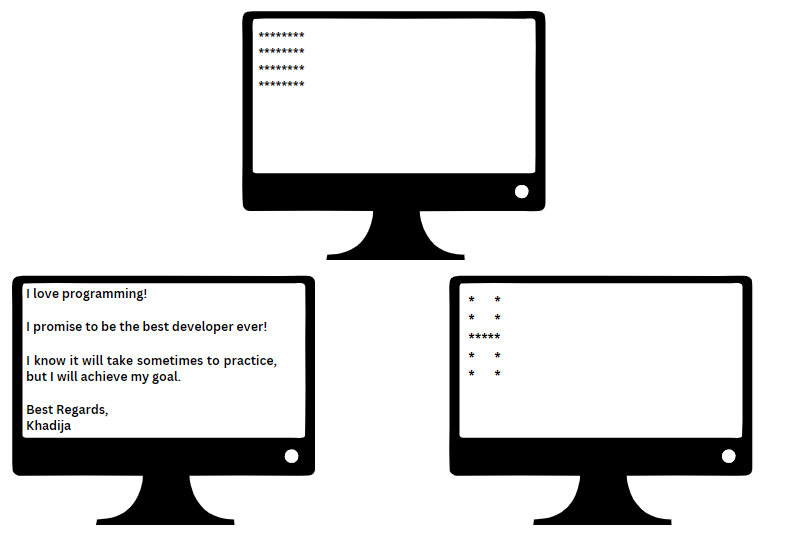

## Printing:

<h4>Problem:<h4>

Write programs to do the following:

Do not add this line "using namespace std;" to your code

<h4>Solution:<h4>

problem1-square.cpp, problem1-h.cpp, and problem1-letter.cpp

