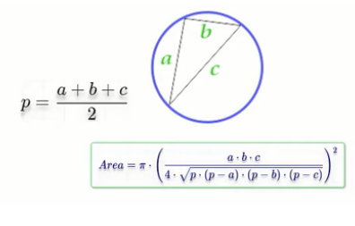

## Problem #1: Print your name

Write a program to print your name on the screen.

## Problem #2: Read name and print it

Write a program to ask the user to enter his/her name and print it on the screen

## Problem #3: Check Odd or Even

Write a program to ask the user to enter a number, then print "Odd" if it is odd,
or "Even" if it is even.

## Problem #4: Hire a driver case I

Write a program that ask the user to enter his/her:
  - Age
  - Driving license.
  Write a program that ask the user to enter his/her:
Then print "Hired" if his/her age is greater than 21 years old and she/he has a
driving license, otherwise print "Rejected".

## Problem #5: Hire a driver case II

Write a program that ask the user to enter his/her:
  - Age
  - Has driving license.
  - Has recommendation
  Write a program that ask the user to enter his/her:
Then print "Hired" if s/he has recommendations or if his/her age is greater than
21 years old and she/he has a driving license, otherwise print "Rejected".

## Problem #6: Full Name

Write a program that ask the user to enter his/her:
  - First name
  - Last name
  Write a program that ask the user to enter his/her:
Then print the full name on the screen.
  Example Input:
  Khadija
  Rejjaoui
  Output:
  Khadija Rejjaoui

## Problem #7: Half number

Write a program that ask the user to enter a number, then print "Half of (number) is (???)"on the screen.
 Example Input:
 50
 Output:
 Half of 50 is 25

## Problem #8: Pass/Fail

Write a program that ask the user to enter a mark, then print "Pass" if the mark
is greater or equal to 50 , otherwise print fail
 Example Input:
 80
 Output:
 Pass

## Problem #9: Sum of 3 numbers

Write a program to ask the user to enter 3 numbers, then print sum of the
entered numbers.
 Example Input:
 10
 30
 5
 Output:
 45

## Problem #10: Average of 3 marks

Write a program to ask the user to enter 3, then print average of the entered
marks.
 Example Input:
 50
 60
 70
 Output:
 60

## Problem #11: Average Pass/Fail

Write a program to ask the user to enter 3, then print average of the entered
average, if the average >= 50 print "Pass" otherwise print "Fail" .
 Example Input:
 50
 60
 70
 Output:
 60
 "Pass"

## Problem #12: Max of 2 numbers

Write a program to ask the user to enter 2 numbers, then print the max number.
 Example Input:
 20
 100
 Output:
 100

## Problem #13: Max of 3 numbers

Write a program to ask the user to enter 3 numbers, then print the max number.
 Example Input:
 20
 100
 300
 Output:
 300

## Problem #14: Swap numbers

Write a program to ask the user to enter 2 numbers, then print them, after that
swap them and print them again

## Problem #15: Rectangle Area I

Write a program to calculate rectangle area and print it on the screen.
 Example Input:
 5
 10
 Output:
 50
 

## Problem #16: Rectangle Area II

Write a program to calculate rectangle area through diagonal and side area of
rectangle and print it on the screen.
 Example Input:
 5
 40
 Output:
 198.431
 

## Problem #17: Triangle Area

Write a program to calculate triangle area then print it on the screen.
 Example Input:
 10
 8
 Output:
 40
 

## Problem #18: Circle Area I

Write a program to calculate circle area then print it on the screen.
 Example Input:
 5
 Output:
 78.54
 

## Problem #19: Circle Area II

Write a program to calculate circle area through diameter, then print it on the
screen.
 Example Input:
 10
 Output:
 78.54
 

## Problem #20: Circle Area III

Write a program to calculate circle area inscribed in a square, then print it on the
screen.
 Example Input:
 10
 Output:
 78.54
 

## Problem #21: Circle Area IV

Write a program to calculate circle area along the circumstance, then print it on
the screen.
 Example Input:
 20
 Output:
 31.847
 

## Problem #22: Circle Area V

Write a program to calculate circle area inscribed in an isosceles triangle, then
print it on the screen.
 Example Input:
 20
 10
 Output:
 47.124
 

## Problem #23: Circle Area VI

Write a program to calculate circle area circle described around an arbitrary
triangle, then print it on the screen.
 Example Input:
 5
 6
 7
 Output:
 40.088
 

## Problem #24: Validate Age Between 18 and 45

Write a program to ask the user to enter his/ her age. If the age is between 18
and 45 print "Valid Age" otherwise print "Invalid Age"
 Example Input:
 30
 Output:
 Valid Age

## Problem #25: Read Until Age Between 18 and 45

Write a program to ask the user to enter his/ her age. If the age is between 18
and 45 print "Valid Age" otherwise print "Invalid Age" and re-ask user to enter a
valid age.

## Problem #26: Print Numbers from 1 to N

Write a program that print from 1 to N.
 Example input:
 5
 Output:
 1
 2
 3
 4
 5

## Problem #27: Print Numbers from N to 1

Write a program that print from N to 1.
 Example input:
 5
 Output:
 5
 4
 3
 2
 1

## Problem #28: Print Sum Odd Numbers from 1 to N

Write a program to sum odd numbers from 1 to N.
 Example input:
 5
 Output:
 9

## Problem #29: Print Sum Even Numbers from 1 to N

Write a program to sum even numbers from 1 to N.
 Example input:
 5
 Output:
 6

## Problem #30: Sum 1 To N

You are tasked with creating a program that calculates the sum of numbers based on user input. The program should provide the user with options to choose what type of numbers they want to include in the sum: all numbers, even numbers, or odd numbers. The program should then calculate the sum based on the selected option and display the result.

 Requirements:
 1. The program should prompt the user to enter a number.
 2. The program should provide the following options for the user to select what type of numbers they want to include in the sum:
 a. Sum All Numbers: Calculate the sum of all numbers from 1 to the user-entered number.
 b. Sum Even Numbers: Calculate the sum of all even numbers from 1 to the user-entered number.
 c. Sum Odd Numbers: Calculate the sum of all odd numbers from 1 to the user-entered number.
 3. The program should display appropriate messages to inform the user of their selections and the calculated sum.

## Problem #31: Factorial of N!

Write a program to calculate Factorial of N!
 Example input:
 6
 Output:
 720

## Problem #32: Power of 2,3,4

Write a program to ask the user to enter a number and print number^2,
number^3, number^4
 Example Input:
 3
 Output:
 9
 27
 81

## Problem #33: Power of M

Write a program to ask the user to enter a number and power and print result
 Example Input:
 2
 4
 Output:
 16

## Problem #34: Grade A,B,C,D,E,F

Write a program to ask the user to enter his/ her mark and print his/her grade.
 90 - 100 Print A.
 80 - 89 Print B.
 70 - 79 Print C.
 60 - 69 Print D.
 50 - 59 Print E.
 Otherwise Print F.

## Problem #35: Commission Percentage

 >= 1000,000 -> percentage is 1%
 > 500K to 1M -> percentage is 2%
 >100K to 500K -> percentage is 3%
 >50K to 100K -> percentage is 3%
 > Otherwise -> percentage 0%
 > Write a program to ask the user to enter TotalSales and print the commission.
 > The commission is calculated as percentage \* the total sale amount.
 Example Input:
 110,000
 Output
 3,300

## Problem #36: Piggy Bank Calculator

Write a program to ask the user to enter Pennies, Nickels, Dimes, Quarters,
Dollars. Print the TotalPennies and TotalDollars.
 Penny = 1
 Nickel = 5
 Dime = 10
 Quarter = 25
 Dollar = 100

## Problem #37: Simple Calculator

Write a program to ask the user to enter two numbers and operation type.
 "+" Add two numbers
 "-" Subtract two numbers
 "\*" Multiply two numbers
 "/" Divide two numbers

## Problem #37: Sum Until -99

Write a program to read numbers from the user and sum them, keep reading
until the user enter -99 then print the sum on the screen.
 10
 20
 -99
 Output:
 30

## Problem #38: Is Prime Number

Write a program to read a number and check if it is a prime number or not. Print
"Prime" if it is prime, and "Not Prime" otherwise.
A prime number can only be divided by 1 and itself.
 5
 Output:
 Prime

## Problem #39: Pay Remainder

Write a program to read TotalBill and CashPaid and calculate the remainder to
be paid back.
 20
 50
 Output:
 30

## Problem #40: Service Fee and Sales Tax

A restaurant charges 10% service fees and 16% sales tax.
Write a program to read BillValue and add service fees and sales tax to it, and
print TotalBill on screen.
 100
 Output:
 127.6

## Problem #41: Weeks and Days

Write a program to read NumberOfHours and calculate the number of weeks
and days included in that number.

## Problem #42:Task Duration In Seconds

Write a program to calculate the task duration in seconds and print it on the
screen. -> Given the time duration of task in the number of days, hours, minutes,
and seconds.
 example
 2
 5
 45
 35
 Output:
 193,535 Seconds
