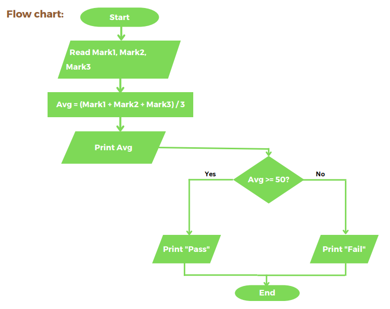

## Problem #11: Average Pass/Fail

Write a program to ask the user to enter 3, then print average of the entered
average, if the average >= 50 print "Pass" otherwise print "Fail" .
 Example Input:
 50
 60
 70
 Output:
 60
 "Pass"

