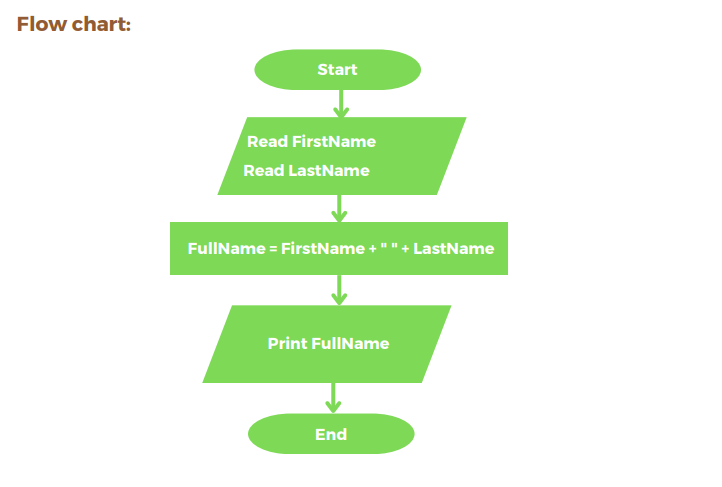

## Problem #6: Full Name

Write a program that ask the user to enter his/her:
  - First name
  - Last name
  Write a program that ask the user to enter his/her:
Then print the full name on the screen.
  Example Input:
  Khadija
  Rejjaoui
  Output:
  Khadija Rejjaoui

