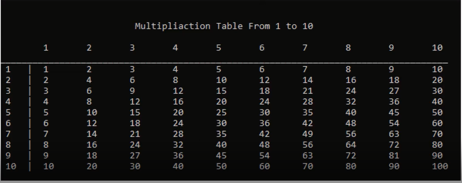

Problems and Solutions Set 2

## Problem1: Multiplication Table 1 To 10

Write a program to print the multiplication table as the following:

## Problem2: Print Prime Numbers From 1 To N

Write a program to print all prime numbers from 1 to N.
  Example Input:
  10
 Output:
 1
 2
 3
 5
 7

## Problem3:Perfect Number:

Write a program to check if the number is perfect or not.
 Note: Prfect Number = Sum (all divisors).
  Ex: 28 = 1 + 2 + 4 + 7 + 14
  Ex: 6 = 1 + 2 + 3
  Example Input:
  28
  Output:
  28 is perfect
  Example Input:
  12
  Output:
  12 is not perfect

## Problem4: Perfect Numbers From 1 To N

Write a program to print all perfect numbers from 1 to N.
  Example Input:
  500
 Output:
 6
 28
 496

## Problem5: Print Digits in Reversed Order:

Write a program to read a number and print it in the reversed order.
  Input:
  1234
 Output:
 4
 3
 2
 1

## Problem6: Sum all digits:

Write a program to read a number and print the sum of its digits.
  Example Input:
  1234
  Output:
  Sum Of Digits = 10

## Problem7: Reversed Number

Write a program to read a number and print its reversed.
  Example Input:
  1234
 Output:
 4321

## Problem8: Digits Frequency

Write a program to read a number and a digit, then print digits frequency in that number.
  Example Input:
  1223222
  2
  Output:
  Digit 2 Frequency is 5 Time(s).

## Problem9: Digits Frquency

Write a program that reads a number and prints all digits frequencies in that number.
 Input:
 1223222
 Output:
 Digit 1 Frequency is 1 Time(s).
 Digit 2 Frequency is 5 Time(s).
 Digit 3 Frequency is 1 Time(s).

## Problem10: Print digits in order

Write a program to read a number and print it in order from left to right.
 Example Input:
 1234
 Example Output:
 1
 2
 3
 4

## Problem11: Palindrome Number

Write a program to read a number and check if it palindrome.
 Note: Palindrom is a number that reads the same from the right and left
 Example Input:
 12321
 Ouput:
 No, it is not a Plaindrome Number.
 Example Input 2:
 1234
 Ouput:
 Yes, it is a Plaindrome Number.

## Problem12: Inverted Number Pattern:

Write a program to read a number and print inverted pattern as follows:
  Input:
  3
  Output
  333
  22
  1

## Problem13: Number Pattern

Write a program to read a number and print number pattern as follows:
  Input:
  3
  Output
  1
  22
  333

## Problem14: Inverted Letter Pattern:

Write a program to read a number and print inverted pattern as follows:
  Input:
  3
  Output
  CCC
  BB
  A
