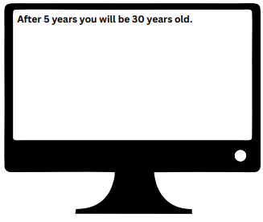
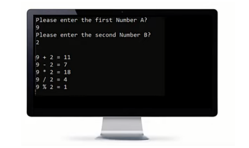

## printing-v1:

<h3>Problems:</h3>

Write programs to do the following:

Do not add this line "using namespace std;" to your code

<h3>Solution:</h3>

print-square.cpp, print-h.cpp, and print-text.cpp

## printing-v2:

<h3>Problems:</h3>

Remove all std:: from all the program in the Printing problems

<h3>Solution:</h3>

print-square-v2.cpp, print-h-v2.cpp, and print-v2-text.cpp

## escape-sequences

<h3>Problems:</h3>

Write programs to do the following:

<h3>Solution:</h3>

ring-bell.cpp, message.cpp, and names.cpp

## Variables

<h3>Problem 1:</h3>

Write a program that declare variables and print them as following:

<h3>solution:</h3>

var-card-info.cpp

<h3>Problem 2:</h3>

Write a program that declare variables num1, num2, and num3 where num1 = 20, num2 = 30, and num3 = 10. Calculate their sum and store it in a variable called total and print them as following:

<h3>solution:</h3>

var-sum-operation.cpp

<h3>Problem 3:</h3>

Consider that the age is equal now to 25 years old print the age after 5 years like the following:

<h3>solution:</h3>

var-age-calculation.cpp

## raeding:

<h3>Problems:</h3>

Repeat the pervious problem, but this time take the data from the user

<h3>Solution:</h3>

read-card-info.cpp, read-sum-operation.cpp, and read-age-calculation.cpp

## size-range

<h3>Problem1</h3>

Write a program that prints size of int, short, float, long, long long, char, double, string, bool 

<h3>Solution</h3>

data-type-size.cpp

<h3>Problem1</h3>

Write a program that prints range of different data types and type modifiers 

<h3>Solution</h3>

data-type-ranges.cpp

## arithmatic operations:

<h3>Problem1</h3>

Write a program to do the following:

<h3>Solution</h3>

small-calculator.cpp

<h3>Problem 2</h3>

Write a program that ask the user to enter a number, then print "Half of number is ???"on the screen.
Example Input:
50
Output:
Half of 50 is 25

<h3>Solution</h3>

half-number.cpp

<h3>Problem 3</h3>

Write a program to ask the user to enter 3 numbers, then print sum of the
entered numbers.
Example Input:
10
30
5
Output:
45

<h3>Solution</h3>

sum-operation.cpp

<h3>Problem 4</h3>

Write a program to ask the user to enter 3, then print average of the entered
marks.
Example Input:
50
60
70
Output:
60

<h3>Solution</h3>

calculate-average.cpp

<h3>Problem 5</h3>

Write a program to ask the user to enter a number and print number^2, number^3, number^4
Example Input:
3
Output:
9
27

<h3>Solution</h3>

calculate-power.cpp

<h3>Problem 6</h3>

Write a program to ask the user to enter Pennies, Nickels, Dimes, Quarters,
Dollars. Print the TotalPennies and TotalDollars.
Penny = 1
Nickel = 5
Dime = 10
Quarter = 25
Dollar = 100

<h3>Solution</h3>

total-dollars-pennies.cpp

<h3>Problem 7</h3>

Write a program to read TotalBill and CashPaid and calculate the remainder to be paid back.
20
50
Output:
30

<h3>Solution</h3>

calculate-remainder.cpp

<h3>Problem 8</h3>

A restaurant charges 10% service fees and 16% sales tax.
Write a program to read BillValue and add service fees and sales tax to it, and
print TotalBill on screen.
100
Output:
127.6

<h3>Solution</h3>

total-bill.cpp

