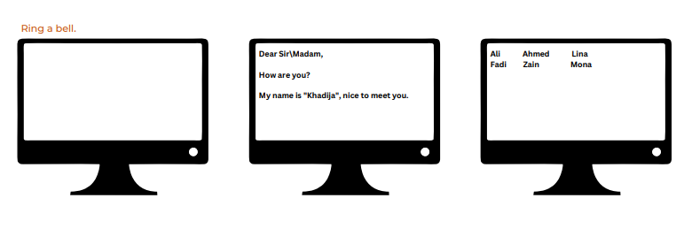
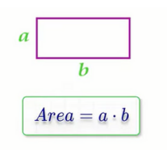
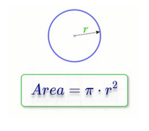
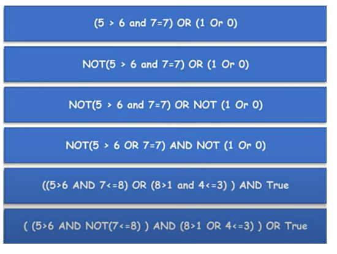

## printing-v1:

<h3>Problems:</h3>

Write programs to do the following:

Do not add this line "using namespace std;" to your code

<h3>Solution:</h3>

print-square.cpp, print-h.cpp, and print-text.cpp

## printing-v2:

<h3>Problems:</h3>

Remove all std:: from all the program in the Printing problems

<h3>Solution:</h3>

print-square-v2.cpp, print-h-v2.cpp, and print-v2-text.cpp

## escape-sequences

<h3>Problems:</h3>

Write programs to do the following:

<h3>Solution:</h3>

ring-bell.cpp, message.cpp, and names.cpp

## Variables

<h3>Problem 1:</h3>

Write a program that declare variables and print them as following:

<h3>solution:</h3>

var-card-info.cpp

<h3>Problem 2:</h3>

Write a program that declare variables num1, num2, and num3 where num1 = 20, num2 = 30, and num3 = 10. Calculate their sum and store it in a variable called total and print them as following:

<h3>solution:</h3>

var-sum-operation.cpp

<h3>Problem 3:</h3>

Consider that the age is equal now to 25 years old print the age after 5 years like the following:

<h3>solution:</h3>

var-age-calculation.cpp

## raeding:

<h3>Problems:</h3>

Repeat the pervious problem, but this time take the data from the user

<h3>Solution:</h3>

read-card-info.cpp, read-sum-operation.cpp, and read-age-calculation.cpp

## size-range

<h3>Problem1</h3>

Write a program that prints size of int, short, float, long, long long, char, double, string, bool 

<h3>Solution</h3>

data-type-size.cpp

<h3>Problem1</h3>

Write a program that prints range of different data types and type modifiers 

<h3>Solution</h3>

data-type-ranges.cpp

## arithmetic operations:

<h3>Problem1</h3>

Write a program to do the following:

<h3>Solution</h3>

small-calculator.cpp

<h3>Problem 2</h3>

Write a program that ask the user to enter a number, then print "Half of number is ???"on the screen.
 Example Input:
 50
 Output:
 Half of 50 is 25

<h3>Solution</h3>

half-number.cpp

<h3>Problem 3</h3>

Write a program to ask the user to enter 3 numbers, then print sum of the
entered numbers.
 Example Input:
 10
 30
 5
 Output:
 45

<h3>Solution</h3>

sum-operation.cpp

<h3>Problem 4</h3>

Write a program to ask the user to enter 3, then print average of the entered
marks.
 Example Input:
 50
 60
 70
 Output:
 60

<h3>Solution</h3>

calculate-average.cpp

<h3>Problem 5</h3>

Write a program to ask the user to enter a number and print number^2, number^3, number^4
 Example Input:
 3
 Output:
 9
 27

<h3>Solution</h3>

calculate-power.cpp

<h3>Problem 6</h3>

Write a program to ask the user to enter Pennies, Nickels, Dimes, Quarters,
Dollars. Print the TotalPennies and TotalDollars.
 Penny = 1
 Nickel = 5
 Dime = 10
 Quarter = 25
 Dollar = 100

<h3>Solution</h3>

total-dollars-pennies.cpp

<h3>Problem 7</h3>

Write a program to read TotalBill and CashPaid and calculate the remainder to be paid back.
 20
 50
 Output:
 30

<h3>Solution</h3>

calculate-remainder.cpp

<h3>Problem 8</h3>

A restaurant charges 10% service fees and 16% sales tax.
Write a program to read BillValue and add service fees and sales tax to it, and
print TotalBill on screen.
 100
 Output:
 127.6

<h3>Solution</h3>

total-bill.cpp

<h3>Problem 9</h3>

Write a program to calculate the task duration in seconds and print it on the
screen. -> Given the time duration of task in the number of days, hours, minutes,
and seconds.
 example
 2
 5
 45
 35
 Output:
 193,535 Seconds

<h3>Solution</h3>

task-in-seconds.cpp

<h3>Problem 10</h3>

 Write a program to read a LoanAmount and a MonthlyPayment and
calculate how many months you need to settle the loan
 Example input:
 5000
 500
 Output:
 10 months

<h3>Solution</h3>

calculate-months-number.cpp

<h3>Problem 11</h3>

 Write a program to read LoanAmount and ask you how many months you need to settle the loan, and calculate the monthly installments.
 Example input:
 5000
 10
 Output:
 500

<h3>Solution</h3>

calculate-monthly-payment.cpp

<h3>Problem 12</h3>

 Write a program to calculate rectangle area and print it on the screen
 Example input:
 5
 10
 Output:
 50

 

<h3>Solution</h3>

calculate-rectangle-area.cpp

<h3>Problem 13</h3>

 Write a program to calculate triangle area then print it on the screen
 Example input:
 10
 8
 Output:
 40

 

<h3>Solution</h3>

calculate-triangle-area.cpp

<h3>Problem 14</h3>

 Write a program to calculate circle area then print it on the screen.
 Example input:
 5
 Output:
 78.54

 

<h3>Solution</h3>

calculate-circle-area.cpp

<h3>Problem 15</h3>

 Write a program to calculate circle area through diameter, then print it on the
screen.
 Example input:
 10
 Output:
 78.5

 

<h3>Solution</h3>

circle-area-through-diameter.cpp

<h3>Problem 16</h3>

Write a program to calculate circle area inscribed in a square, then print it on
the screen.
 Example input:
 10
 Output:
 78.5

 

<h3>Solution</h3>

circle-area-inscribed-square.cpp

<h3>Problem 17</h3>

Write a program to calculate circle area along the circumference, then print it on
the screen
 Example input:
 20
 Output:
 31.847

 

<h3>Solution</h3>

circle-area-along-circumference.cpp

<h3>Problem 18</h3>

Write a program to calculate circle area inscribed in an isosceles triangle, then
print it on the screen.

 Example input:
 20
 10
 Output:
 47.1

 

<h3>Solution</h3>

circle-area-inscribed-isosceles-triangle.cpp

## relational-operators

<h3>Problem</h3>

Using relational operators write a program to do the following 

<h3>Solution</h3>

relational-operators.cpp

## logical-operators

<h3>Problem1</h3>

write programs to solve the following problems: 

<h3>Solution</h3>

logical-operators-problem1.cpp

<h3>Problem2</h3>

write programs to solve the following problems: 

<h3>Solution</h3>

logical-operators-problem2.cpp

## cmath-function

<h3>Problem 1</h3>

 Write a program to calculate rectangle area through diagonal and side area of
rectangle and print it on the screen.
 Example input:
 5
 40
 Output:
 198.431

<h3>Solution</h3>

rectangle-area-diagonal-side.cpp

