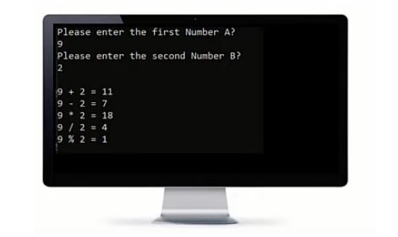

## arithmatic operations:

<h3>Problem1</h3>

Write a program to do the following:

<h3>Solution</h3>

small-calculator.cpp

<h3>Problem 2</h3>

Write a program that ask the user to enter a number, then print "Half of number is ???"on the screen.
Example Input:
50
Output:
Half of 50 is 25

<h3>Solution</h3>

half-number.cpp

<h3>Problem 3</h3>

Write a program to ask the user to enter 3 numbers, then print sum of the
entered numbers.
Example Input:
10
30
5
Output:
45

<h3>Solution</h3>

sum-operation.cpp

