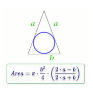
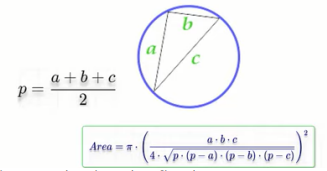

## cmath-function

<h3>Problem 1</h3>

 Write a program to calculate rectangle area through diagonal and side area of
rectangle and print it on the screen.
 Example input:
 5
 40
 Output:
 198.431

<h3>Solution</h3>

rectangle-area-diagonal-side.cpp

<h3>Problem 2</h3>

Write a program to calculate circle area then print it on the screen. After finding the result use the ceil function, and print the final
result.
 Example input:
 5
 Output:
 79

<h3>Solution</h3>

circle-area-1.cpp

<h3>Problem 3</h3>

Write a program to calculate circle area through diameter, then print it on the
screen. After finding the result use the ceil function, and print the final
result.

 Example input:
 10
 Output:
 79

<h3>Solution</h3>

circle-area-2.cpp

<h3>Problem 4</h3>

Write a program to calculate circle area inscribed in a square, then print it on
the screen. After finding the result use the ceil function, and print the final
result.

 Example input:
 10
 Output:
 79

<h3>Solution</h3>

circle-area-3.cpp

<h3>Problem 5</h3>

Write a program to calculate circle area along the circumstance, then print it
on the screen.
After finding the result use the floor function, and print the final result
 Example input:
 20
 Output:
 31

<h3>Solution</h3>

circle-area-4.cpp

<h3>Problem 6</h3>

Write a program to calculate circle area inscribed in an isosceles triangle, then
print it on the screen.
After finding the result use the floor function, and print the final result
 Example input:
 20
 10
 Output:
 47

<h3>Solution</h3>

circle-area-5.cpp

<h3>Problem 7</h3>

Write a program to calculate circle area circle described around an arbitrary
triangle, then print it on the screen. After finding the result use the round function, and print the final
result.
 Example input:
 5
 6
 7
 Output:
 40

<h3>Solution</h3>

circle-area-6.cpp

<h3>Problem 8</h3>

Write a program to ask the user to enter a number and print number^2,
number^3, number^4
 Example input:
 3
 Output:
 9
 27
 81

<h3>Solution</h3>

calculate-power-1.cpp

<h3>Problem 9</h3>

Write a program to ask the user to enter a number and power and print result
 Example input:
 2
 4
 Output:
 16

<h3>Solution</h3>

calculate-power-2.cpp

