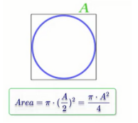

## cmath-function

<h3>Problem 1</h3>

 Write a program to calculate rectangle area through diagonal and side area of
rectangle and print it on the screen.
 Example input:
 5
 40
 Output:
 198.431

<h3>Solution</h3>

rectangle-area-diagonal-side.cpp

<h3>Problem 2</h3>

Write a program to calculate circle area then print it on the screen. After finding the result use the ceil function, and print the final
result.
 Example input:
 5
 Output:
 79

<h3>Solution</h3>

circle-area-1.cpp

<h3>Problem 3</h3>

Write a program to calculate circle area through diameter, then print it on the
screen. After finding the result use the ceil function, and print the final
result.

 Example input:
 10
 Output:
 79

<h3>Solution</h3>

circle-area-2.cpp

<h3>Problem 4</h3>

Write a program to calculate circle area inscribed in a square, then print it on
the screen. After finding the result use the ceil function, and print the final
result.

 Example input:
 10
 Output:
 79

<h3>Solution</h3>

circle-area-3.cpp

<h3>Problem 5</h3>

Write a program to calculate circle area along the circumstance, then print it
on the screen.
After finding the result use the floor function, and print the final result
 Example input:
 20
 Output:
 31

<h3>Solution</h3>

circle-area-4.cpp

